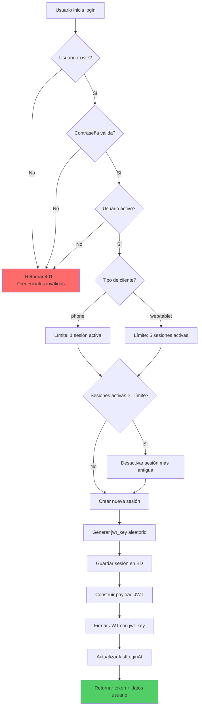
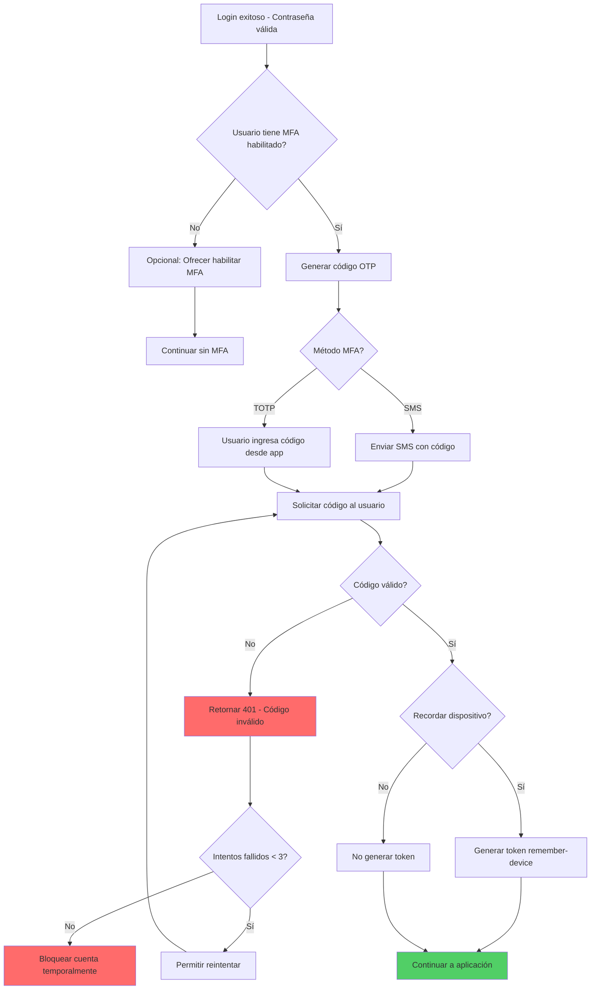
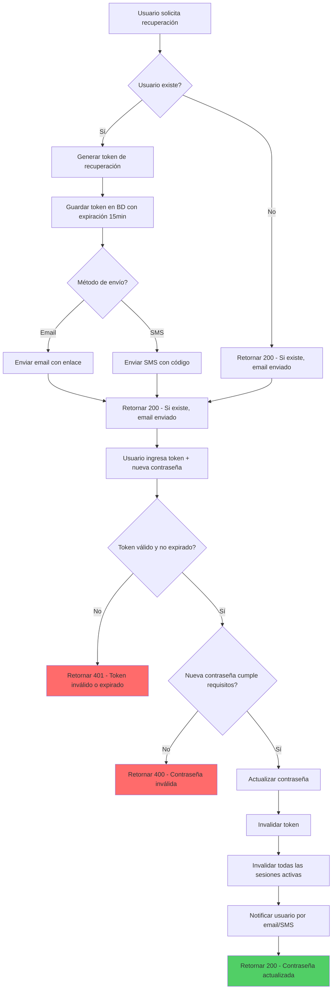
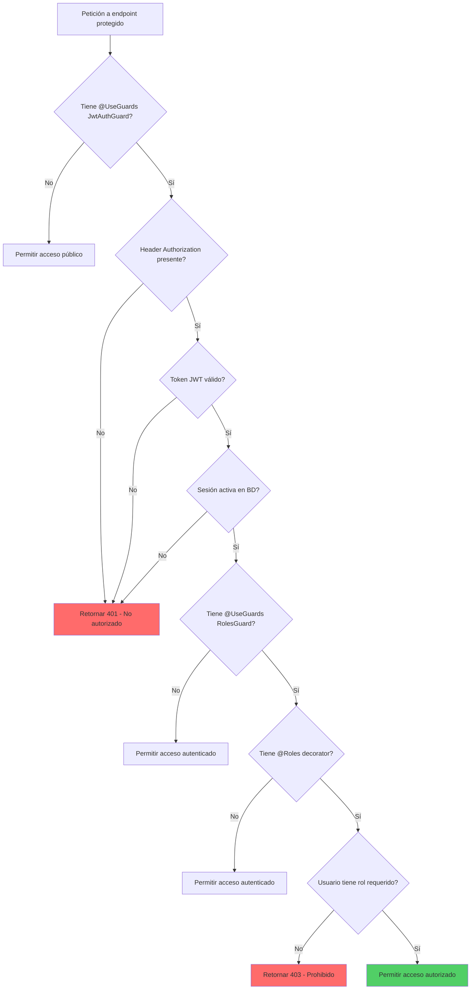
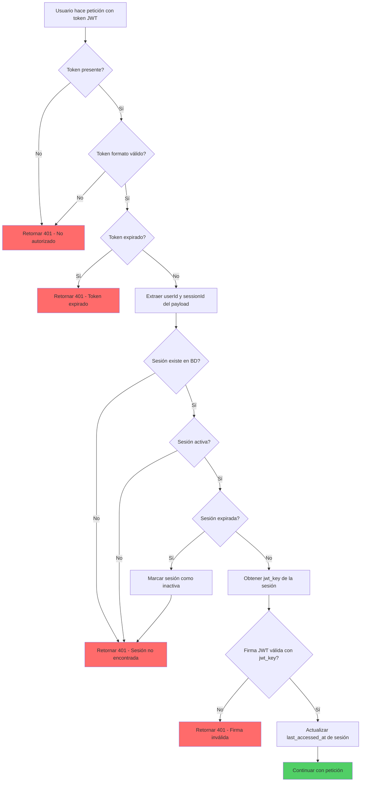

# INFORME EJECUTIVO DE AUDITORÍA DE SEGURIDAD Y CALIDAD
## Proyecto BOLOS - Plataforma de Transporte de Pasajeros

**Fecha:** 2 de julio de 2026  
**Auditor:** CTO y Arquitecto de Software Líder  
**Alcance:** Sistema completo (Backend NestJS, Base de Datos PostgreSQL, Redis, Docker)  
**Estándares:** ISO 27001, OWASP Top 10 (2021), Mejores Prácticas de la Industria  
**Versión del Sistema:** 0.0.1 (Desarrollo)

---

## 1. RESUMEN EJECUTIVO

### 1.1 Estado General del Sistema

El proyecto BOLOS se encuentra en una **fase intermedia de desarrollo** con una arquitectura sólida y bien fundamentada, pero con brechas críticas de seguridad y funcionalidad que deben abordarse antes de cualquier despliegue en producción. El sistema implementa una arquitectura hexagonal (puertos y adaptadores) con separación clara de dominio, aplicación, infraestructura e interfaces, lo cual es una práctica excelente para mantenibilidad y escalabilidad.

**Puntuación Global de Madurez:** 42/100

| Dimensión | Puntuación | Estado |
|-----------|------------|--------|
| Arquitectura | 75/100 | ✅ Sólida |
| Seguridad | 35/100 | ⚠️ Crítico |
| Calidad de Código | 65/100 | ✅ Bueno |
| Pruebas | 55/100 | ⚠️ Parcial |
| Documentación | 40/100 | ⚠️ Insuficiente |
| Observabilidad | 25/100 | ❌ Crítico |
| Completitud Funcional | 40/100 | ⚠️ Parcial |

### 1.2 Principales Riesgos Identificados

#### Riesgos CRÍTICOS (Severidad Alta)

1. **Vulnerabilidades en Dependencias (8 HIGH, 1 MODERATE)**
   - **Severidad:** CRÍTICA
   - **Impacto:** El sistema utiliza versiones de NestJS con vulnerabilidades conocidas (multer DoS, js-yaml DoS). Estas vulnerabilidades podrían permitir ataques de denegación de servicio y explotación de recursos.
   - **Probabilidad:** ALTA
   - **Recomendación:** Actualizar todas las dependencias a versiones seguras inmediatamente.

2. **Módulos Fin y Ops Deshabilitados en Producción**
   - **Severidad:** ALTA
   - **Impacto:** Los módulos financieros y de operaciones están comentados en `app.module.ts`, lo que significa que el sistema no puede procesar pagos ni gestionar rutas en producción.
   - **Probabilidad:** ALTA
   - **Recomendación:** Habilitar y probar completamente estos módulos antes del despliegue.

3. **Ausencia de Autenticación Multifactor (MFA)**
   - **Severidad:** ALTA
   - **Impacto:** El sistema solo utiliza contraseña para autenticación. Si las credenciales de un usuario son comprometidas, un atacante tiene acceso completo a la cuenta.
   - **Probabilidad:** MEDIA
   - **Recomendación:** Implementar MFA (SMS, TOTP, o biometría) para todos los usuarios, especialmente administradores.

4. **Sin Mecanismo de Recuperación de Contraseña**
   - **Severidad:** ALTA
   - **Impacto:** Los usuarios que olvidan su contraseña no tienen forma de recuperar el acceso, lo que podría resultar en pérdida de cuentas y saldo en billetera.
   - **Probabilidad:** ALTA
   - **Recomendación:** Implementar flujo de recuperación con verificación por email/SMS y tokens de un solo uso.

5. **Falta de Auditoría Implementada**
   - **Severidad:** ALTA
   - **Impacto:** Aunque existe la tabla `audit.audit_log`, no hay endpoints ni integración que registre eventos. Esto hace imposible rastrear acciones sensibles, investigar incidentes o cumplir con requisitos regulatorios.
   - **Probabilidad:** ALTA
   - **Recomendación:** Implementar middleware de auditoría que registre todos los eventos sensibles.

#### Riesgos ALTOS (Severidad Media-Alta)

6. **Rate Limiting Solo en Login**
   - **Severidad:** MEDIA-ALTA
   - **Impacto:** Solo el endpoint de login tiene rate limiting (5 req/min). Los demás endpoints están desprotegidos contra ataques de fuerza bruta o DoS.
   - **Probabilidad:** MEDIA
   - **Recomendación:** Implementar rate limiting global con límites diferenciados por tipo de endpoint.

7. **CORS Configurado pero No Restrictivo**
   - **Severidad:** MEDIA
   - **Impacto:** El origen CORS se configura desde variable de entorno con fallback a localhost. En producción, esto podría permitir orígenes no autorizados si la variable no se configura correctamente.
   - **Probabilidad:** MEDIA
   - **Recomendación:** Implementar whitelist de orígenes permitidos y validación estricta.

8. **Sin Protección CSRF**
   - **Severidad:** MEDIA
   - **Impacto:** El sistema no implementa tokens CSRF, lo que podría permitir ataques de cross-site request forgery si se utilizan cookies.
   - **Probología:** BAJA-MEDIA
   - **Recomendación:** Implementar tokens CSRF para todos los endpoints que modifican estado.

9. **Falta de Sanitización de Inputs**
   - **Severidad:** MEDIA
   - **Impacto:** Aunque se usa class-validator, no hay sanitización explícita de inputs para prevenir XSS, inyección SQL (aunque TypeORM mitiga), u otros ataques de inyección.
   - **Probabilidad:** MEDIA
   - **Recomendación:** Implementar sanitización con librerías como `express-mongo-sanitize` o `DOMPurify`.

10. **Gestión de Secretos en Archivos Locales**
    - **Severidad:** MEDIA
    - **Impacto:** Los secretos se almacenan en archivos `secrets/*.txt` en el repositorio. Aunque están en `.gitignore`, esto no es una práctica segura para producción.
    - **Probabilidad:** BAJA
    - **Recomendación:** Migrar a Docker Secrets, Vault, o AWS Secrets Manager.

### 1.3 Nivel de Madurez de Seguridad

**Nivel Actual:** NIVEL 1 (INICIAL) - Ad-hoc

El sistema tiene controles de seguridad básicos implementados (JWT, bcrypt, Helmet, rate limiting parcial), pero carece de una estrategia de seguridad integral. No hay políticas de seguridad documentadas, no hay monitoreo de seguridad, y no hay proceso de gestión de vulnerabilidades.

**Nivel Objetivo para MVP:** NIVEL 2 (REPETIBLE) - Mínimo viable para producción

Para alcanzar el nivel 2, se requiere:
- Política de seguridad documentada
- Proceso de gestión de vulnerabilidades
- Auditoría de seguridad implementada
- MFA para usuarios críticos
- Rate limiting global
- Monitoreo básico de seguridad

### 1.4 Recomendación de Siguiente Paso

**El sistema NO ESTÁ LISTO para producción.**

Antes de considerar cualquier despliegue en producción, se deben completar las siguientes acciones CRÍTICAS (en orden de prioridad):

1. **Actualizar todas las dependencias vulnerables** (1-2 días)
2. **Habilitar y probar módulos Fin y Ops** (3-5 días)
3. **Implementar auditoría de eventos** (2-3 días)
4. **Implementar MFA para administradores** (3-5 días)
5. **Implementar recuperación de contraseña** (2-3 días)
6. **Implementar rate limiting global** (1-2 días)
7. **Configurar CORS de forma restrictiva** (1 día)
8. **Implementar monitoreo y alertas** (3-5 días)

**Tiempo estimado para alcanzar nivel mínimo de producción:** 15-25 días de desarrollo dedicado.

---

## 2. MATRIZ DOFA (DEBILIDADES, OPORTUNIDADES, FORTALEZAS, AMENAZAS)

### 2.1 Matriz Completa

| Categoría | Elemento | Justificación |
|-----------|----------|---------------|
| **DEBILIDADES** | Módulos Fin y Ops deshabilitados | Los módulos financieros y de operaciones están comentados en `app.module.ts`, impidiendo funcionalidad core del sistema. |
| | Ausencia de MFA | Solo autenticación por contraseña, sin segundo factor de verificación. |
| | Sin recuperación de contraseña | Los usuarios no pueden recuperar acceso si olvidan credenciales. |
| | Auditoría no implementada | Tabla `audit.audit_log` existe pero no se usa; no hay registro de eventos. |
| | Rate limiting parcial | Solo login tiene rate limiting; resto de endpoints desprotegidos. |
| | Vulnerabilidades en dependencias | 9 vulnerabilidades (8 HIGH, 1 MODERATE) en paquetes npm. |
| | Gestión de secretos en archivos | Secretos en archivos locales en lugar de vault/secrets manager. |
| | Sin protección CSRF | No hay tokens CSRF para endpoints que modifican estado. |
| | Falta sanitización de inputs | Solo validación, sin sanitización explícita contra XSS/inyección. |
| | Monitoreo inexistente | No hay sistema de monitoreo, alertas, o dashboards. |
| | Documentación de seguridad insuficiente | No hay política de seguridad documentada ni guías de hardening. |
| | Pruebas de integración limitadas | Solo hay pruebas unitarias; faltan pruebas E2E y de seguridad. |
| | Módulos Trip y Audit sin implementar | Solo existen tablas en BD; sin lógica de negocio ni endpoints. |
| | CORS no restrictivo | Configuración CORS básica sin whitelist estricta. |
| | Sin headers de seguridad adicionales | Solo Helmet básico; faltan headers como CSP, HSTS, X-Frame-Options. |
| | No hay pruebas de carga | No se ha validado el comportamiento bajo alta concurrencia. |
| | Logs no estructurados | Logging básico con NestJS Logger; sin formato estructurado (JSON). |
| | Sin backup automatizado | No hay estrategia de backup ni recuperación ante desastres. |
| | Falta documentación API | No hay documentación Swagger/OpenAPI completa para consumidores. |
| **OPORTUNIDADES** | Arquitectura hexagonal sólida | Separación clara de capas facilita testing y migración a microservicios. |
| | UUID v7 nativo | IDs ordenables temporalmente, ideal para distribuidos. |
| | PostGIS integrado | Capacidad geoespacial nativa para tracking GPS. |
| | OCC en billeteras | Control de concurrencia optimista previene race conditions financieras. |
| | JWT por sesión | Claves rotativas por sesión invalidan tokens anteriores automáticamente. |
| | Docker Compose listo | Infraestructura como código facilita despliegue y escalado. |
| | Redes segmentadas | Separación de redes (db_net, cache_net, api_net) sigue principio de mínimo privilegio. |
| | Montos en centavos (BIGINT) | Precisión financiera exacta sin errores de punto flotante. |
| | Triggers de inmutabilidad | `fin.transactions` y `audit.audit_log` protegidos contra modificaciones. |
| | Suite de tests existente | 149 tests pasando, base sólida para expandir cobertura. |
| | Validadores personalizados | Decoradores para teléfono venezolano, cédula, email validan formato local. |
| | Soft delete implementado | `deleted_at` permite recuperación de datos eliminados. |
| | Roles y guards implementados | RBAC básico con `@Roles()` decorator y `RolesGuard`. |
| | SessionCleanupService | Limpieza automática de sesiones expiradas cada hora. |
| | SCRAM-SHA-256 en PostgreSQL | Autenticación de BD con algoritmo moderno y seguro. |
| | Redis con comandos peligrosos deshabilitados | FLUSHALL, FLUSHDB, DEBUG deshabilitados en redis.conf. |
| | Healthchecks implementados | Endpoints `/health` para monitoreo de disponibilidad. |
| | Colección Postman existente | Flujos de prueba documentados para validación manual. |
| | Middleware Go en desarrollo | API Gateway en Go para rate limiting y seguridad avanzada. |
| **FORTALEZAS** | Stack tecnológico moderno | Node.js 24, NestJS 11, TypeScript 5.7, PostgreSQL 18, Redis 7. |
| | Arquitectura modular | 5 módulos separados (auth, ops, fin, trip, audit) listos para microservicios. |
| | Validaciones exhaustivas | Teléfono venezolano, cédula/pasaporte, email estricto, contraseña robusta. |
| | bcrypt para contraseñas | Hashing seguro con factor de trabajo adecuado. |
| | JWT con claves por sesión | Cada login genera nueva clave, invalidando sesiones anteriores. |
| | Helmet implementado | Headers de seguridad básicos configurados globalmente. |
| | ValidationPipe global | Whitelist y forbidNonWhitelisted activados. |
| | LoggingMiddleware global | Todas las peticiones son logueadas. |
| | Índices de BD optimizados | 63 índices incluyendo compuestos, parciales y espaciales GIST. |
| | FKs y constraints en BD | Integridad referencial garantizada a nivel de base de datos. |
| | Unicidad comprobada | Control de 409 Conflict para teléfono, email, cédula duplicados. |
| | lastLoginAt actualizado | Registro de último login en cada autenticación exitosa. |
| | Sub-admins con herencia | `association_admin` puede crear admins que heredan su asociación. |
| | Rate limiting en login | 5 req/min previene fuerza bruta en autenticación. |
| | CORS habilitado | Configuración CORS para frontend React. |
| | ThrottlerModule configurado | Rate limiting global a nivel de aplicación. |
| | Excepciones globales filtradas | `AllExceptionsFilter` estandariza respuestas de error. |
| | Esquemas separados por módulo | auth, ops, fin, trip, audit separados en PostgreSQL. |
| | PostGIS para geoespacial | Soporte nativo para coordenadas GPS y cálculos de distancia. |
| | pgcrypto para hashing | Funciones criptográficas nativas de PostgreSQL. |
| | Docker secrets en desarrollo | Uso de secrets para credenciales en entorno local. |
| **AMENAZAS** | Ataques de fuerza bruta | Rate limiting parcial podría no ser suficiente contra ataques distribuidos. |
| | Compromiso de dependencias | 9 vulnerabilidades conocidas podrían ser explotadas. |
| | Phishing de credenciales | Sin MFA, credenciales comprometidas dan acceso total. |
| | Inyección SQL | Aunque TypeORM mitiga, falta sanitización podría dejar brechas. |
| | XSS en frontend | Sin sanitización de inputs, frontend React podría ser vulnerable. |
| | CSRF en aplicaciones web | Sin tokens CSRF, ataques cross-site request forgery posibles. |
| | DoS en endpoints sin rate limiting | Atacantes podrían saturar endpoints críticos. |
| | Exposición de secretos | Secretos en archivos locales podrían ser comprometidos en repositorio. |
| | Pérdida de datos sin backup | Sin estrategia de backup, incidentes podrían ser irreversibles. |
| | Auditoría inexistente | Sin registro de eventos, incidentes no pueden investigarse. |
| | Escalado sin pruebas de carga | Sistema podría colapsar bajo tráfico real sin validación previa. |
| | Cambios regulatorios | Sin auditoría, cumplimiento regulatorio (Ley de Datos, etc.) es imposible. |
| | Ataques a billetera | Sin OCC probado en producción, race conditions financieras posibles. |
| | GPS spoofing | Sin validación de coordenadas, conductores podrían falsificar ubicación. |
| | Man-in-the-middle en middleware | Middleware Go sin HTTPS podría ser interceptado. |
| | Redis sin persistencia AOF | AOF desactivado en dev; pérdida de datos en crash posible. |
| | PostgreSQL sin backups automatizados | Sin pg_dump o WAL archiving, recuperación ante desastres imposible. |
| | CVEs en NestJS/Express | Vulnerabilidades en framework base podrían afectar todo el sistema. |
| | Insider threat en admins | Sin MFA, cuentas de admin comprometidas son devastadoras. |

### 2.2 Análisis de la Matriz DOFA

**Debilidades Críticas:** 20 elementos identificados, siendo las más críticas: módulos deshabilitados, ausencia de MFA, auditoría no implementada, y vulnerabilidades en dependencias.

**Oportunidades Clave:** 20 elementos, destacando: arquitectura hexagonal, UUID v7, PostGIS, OCC en billeteras, y JWT por sesión.

**Fortalezas Sólidas:** 20 elementos, con énfasis en: stack moderno, arquitectura modular, validaciones exhaustivas, bcrypt, y seguridad en BD.

**Amenazas Significativas:** 20 elementos, priorizando: ataques de fuerza bruta, compromiso de dependencias, phishing, y pérdida de datos.

**Balance DOFA:** El sistema tiene una base técnica sólida (fortalezas) con potencial significativo (oportunidades), pero enfrenta debilidades críticas en seguridad y completitud funcional que deben abordarse urgentemente para mitigar amenazas reales.

---

## 3. OBSERVACIONES GENERALES

### 3.1 Arquitectura

#### 3.1.1 Patrones Utilizados

**Arquitectura Hexagonal (Puertos y Adaptadores)** ✅
- **Implementación:** Cada módulo (auth, ops, fin, trip, audit) sigue el patrón con separación clara:
  - `domain/`: Entidades puras, puertos (interfaces), excepciones, value objects
  - `application/`: Casos de uso, DTOs internos
  - `infrastructure/`: Módulo NestJS, entidades ORM, repositorios TypeORM, servicios
  - `interfaces/`: Controladores REST, DTOs de validación, guards
- **Evaluación:** EXCELENTE. Facilita testing, desacoplamiento, y migración futura a microservicios físicos.
- **Observación:** La implementación es consistente y bien estructurada en todos los módulos implementados.

**Monolito Modular** ✅
- **Implementación:** Un solo repositorio con módulos separados, esquemas de BD independientes (auth, ops, fin, trip, audit).
- **Evaluación:** BUENO. Permite evolucionar a microservicios cuando sea necesario sin reescribir arquitectura.
- **Observación:** Los módulos Fin y Ops están comentados en `app.module.ts`, lo que rompe el monolito modular en la práctica.

**Inyección de Dependencias (DI)** ✅
- **Implementación:** NestJS DI container con tokens de puerto (`PASSENGER_REPOSITORY_PORT`, etc.) vinculados a implementaciones concretas.
- **Evaluación:** EXCELENTE. Facilita testing con mocks y swapping de implementaciones.
- **Observación:** Uso consistente de `@Inject(TOKEN)` en toda la aplicación.

#### 3.1.2 Acoplamiento

**Acoplamiento entre Módulos** ⚠️
- **AuthModule:** Importa `FinModule` (para crear billeteras automáticamente). Esto crea dependencia circular potencial.
- **OpsModule:** Importa `AuthModule` y `FinModule` (para guards y tarifarios).
- **Evaluación:** ACEPTABLE pero con riesgo de acoplamiento circular.
- **Observación:** Se recomienda usar eventos de dominio (EventBus) para desacoplar creación de billetera de registro de usuario.

**Acoplamiento con Infraestructura** ✅
- **Implement:** Repositorios TypeORM están en `infrastructure/persistence`, separados de dominio.
- **Evaluación:** BUENO. Dominio no depende de TypeORM directamente.
- **Observación:** Los casos de uso inyectan puertos (interfaces), no implementaciones concretas.

#### 3.1.3 Escalabilidad

**Escalabilidad Vertical** ✅
- **Implementación:** Docker Compose con límites de recursos (CPU, memoria) definidos.
- **Evaluación:** BUENA. Límites previenen consumo excesivo de recursos.
- **Observación:** Límites actuales (API: 2 CPU, 1.5GB RAM) podrían ser insuficientes para alta concurrencia.

**Escalabilidad Horizontal** ⚠️
- **Implementación:** No hay configuración para múltiples instancias de API, Redis cluster, o PostgreSQL HA.
- **Evaluación:** INSUFICIENTE. Sistema no está preparado para escalado horizontal.
- **Observación:** Se requiere: load balancer, Redis cluster, PostgreSQL con replication, y sesiones compartidas.

**Escalabilidad de Datos** ⚠️
- **Implementación:** PostgreSQL single-node sin particionamiento. Redis single-node sin clustering.
- **Evaluación:** INSUFICIENTE. No hay estrategia para manejar crecimiento de datos.
- **Observación:** `trip.gps_history` podría crecer rápidamente; se recomienda TimescaleDB para series temporales.

#### 3.1.4 Puntos Únicos de Fallo

**PostgreSQL** ❌ CRÍTICO
- **Estado:** Single-node sin HA, sin backups automatizados.
- **Impacto:** Si PostgreSQL falla, todo el sistema queda inoperativo.
- **Recomendación:** Implementar PostgreSQL HA (replication) + backups automatizados (WAL archiving, pg_dump).

**Redis** ❌ CRÍTICO
- **Estado:** Single-node sin clustering, AOF desactivado.
- **Impacto:** Si Redis falla, sesiones y caché se pierden; rate limiting deja de funcionar.
- **Recomendación:** Implementar Redis cluster + AOF activado + RDB snapshots.

**API NestJS** ⚠️
- **Estado:** Single-container, sin load balancer.
- **Impacto:** Si API falla, no hay redundancia.
- **Recomendación:** Implementar múltiples instancias detrás de load balancer.

**Middleware Go** ⚠️
- **Estado:** Single-container, en desarrollo.
- **Impacto:** Si middleware falla, tráfico externo no puede llegar a API.
- **Recomendación:** Completar desarrollo y implementar HA.

### 3.2 Calidad de Código

#### 3.2.1 Mantenibilidad

**Estructura de Archivos** ✅
- **Implementación:** Estructura consistente siguiendo arquitectura hexagonal.
- **Evaluación:** EXCELENTE. Fácil de navegar y entender.
- **Observación:** Nombres de archivos descriptivos y convenciones consistentes.

**Documentación en Código** ✅
- **Implementación:** JSDoc con bloques `═══` en la mayoría de archivos.
- **Evaluación:** BUENA. Documentación clara de propósito, dependencias y capa.
- **Observación:** Algunos archivos carecen de documentación completa (especialmente DTOs).

**Convenciones de Código** ✅
- **Implementación:** TypeScript con tipado estricto, ESLint configurado, Prettier para formato.
- **Evaluación:** EXCELENTE. Código consistente y type-safe.
- **Observación:** ESLint config parece estar en transición (eslint.config.mjs nuevo).

**Complejidad Ciclomática** ⚠️
- **Implementación:** No se ha medido complejidad ciclomática.
- **Evaluación:** NO VERIFICABLE. Se recomienda usar herramientas como `complexity-report` o `sonarqube`.
- **Observación:** Algunos casos de uso (login, create-wallet) tienen lógica compleja que debería simplificarse.

#### 3.2.2 Deuda Técnica

**Deuda Conocida** ⚠️
- **Módulos comentados:** FinModule y OpsModule comentados en `app.module.ts`.
- **JWT secret vacío:** `JwtModule.register({ secret: '' })` en `auth.module.ts` (línea 111).
- **Dependencias vulnerables:** 9 vulnerabilidades conocidas sin mitigación.
- **Evaluación:** MEDIA. Deuda técnica identificada pero no priorizada.
- **Observación:** Se recomienda crear backlog técnico y asignar prioridades.

**Code Smells Detectados** ⚠️
- **Magic strings:** Strings literales repetidos (ej: 'passenger', 'admin') sin constantes.
- **Long methods:** Algunos casos de uso tienen métodos largos (>50 líneas).
- **Duplicated code:** Validaciones similares en múltiples DTOs.
- **Evaluación:** BAJA-MEDIA. Code smells no críticos pero deberían refactorizarse.
- **Observación:** Se recomienda refactorización incremental durante sprints de mantenimiento.

**Technical Debt Ratio** ⚠️
- **Implementación:** No se ha calculado ratio de deuda técnica.
- **Evaluación:** NO VERIFICABLE. Se recomienda usar SonarQube para medir.
- **Observación:** Estimación visual: ~15-20% de deuda técnica.

#### 3.2.3 Estándares Seguidos/No Seguidos

**Estándares Seguidos** ✅
- **SOLID:** Principios SOLID aplicados en arquitectura hexagonal.
- **DRY:** Lógica reutilizable en servicios compartidos (CryptoService, etc.).
- **Clean Code:** Nombres descriptivos, funciones pequeñas, separación de responsabilidades.
- **TypeScript Best Practices:** Tipado estricto, interfaces sobre tipos, no `any` (excepto en req.user).
- **NestJS Best Practices:** Módulos, providers, guards, pipes utilizados correctamente.

**Estándares No Seguidos** ❌
- **Semantic Versioning:** Versión 0.0.1 sin cambios semánticos documentados.
- **API Versioning:** No hay versionado de endpoints (/v1/, /v2/).
- **OpenAPI/Swagger:** Documentación Swagger parcialmente configurada pero no expuesta.
- **Error Handling:** Excepciones de dominio no mapean a códigos HTTP específicos (todas van a 500).
- **Logging:** Logs no estructurados (texto plano en lugar de JSON).
- **Testing:** No hay pruebas de integración ni E2E, solo unitarias.

### 3.3 Pruebas

#### 3.3.1 Cobertura

**Cobertura de Pruebas Unitarias** ✅
- **Implementación:** 149 tests unitarios pasando en 38 test suites.
- **Módulos con pruebas:**
  - auth: 18 spec files (casos de uso, repositorios, controladores, DTOs)
  - ops: 6 spec files (casos de uso, repositorios, controladores, DTOs)
  - fin: 9 spec files (casos de uso, repositorios, servicios, controladores, DTOs)
  - shared: 5 spec files (servicios, value objects, guards)
- **Evaluación:** BUENA para módulos implementados.
- **Observación:** No hay pruebas para módulos trip y audit (no implementados).

**Cobertura de Pruebas de Integración** ❌
- **Implementación:** No hay pruebas de integración.
- **Evaluación:** CRÍTICA. Faltan pruebas que validen integración entre módulos.
- **Observación:** Se recomienda implementar pruebas de integración con base de datos de prueba.

**Cobertura de Pruebas E2E** ❌
- **Implementación:** No hay pruebas E2E.
- **Evaluación:** CRÍTICA. Faltan pruebas que validen flujos completos de usuario.
- **Observación:** Se recomienda implementar pruebas E2E con Playwright o Cypress.

**Cobertura de Pruebas de Seguridad** ❌
- **Implementación:** No hay pruebas de seguridad.
- **Evaluación:** CRÍTICA. Faltan pruebas que validen vulnerabilidades comunes.
- **Observación:** Se recomienda implementar pruebas con OWASP ZAP o Burp Suite.

#### 3.3.2 Tipos de Pruebas Existentes

**Pruebas Unitarias** ✅
- **Herramienta:** Jest
- **Cobertura:** Casos de uso, repositorios, controladores, DTOs, guards, servicios.
- **Calidad:** BUENA. Tests bien estructurados con mocks apropiados.
- **Observación:** Algunos tests usan `any` excesivamente; se recomienda tipado estricto.

**Pruebas de DTOs** ✅
- **Herramienta:** Jest + class-validator
- **Cobertura:** Validaciones de teléfono, email, cédula, contraseña.
- **Calidad:** EXCELENTE. Validadores personalizados bien testeados.
- **Observación:** Faltan tests para edge cases (boundary values).

**Pruebas de Controladores** ✅
- **Herramienta:** Jest + supertest
- **Cobertura:** Endpoints de auth, ops, fin.
- **Calidad:** BUENA. Tests de HTTP status y respuestas.
- **Observación:** Faltan tests de autenticación/autorización en controladores.

#### 3.3.3 Tipos de Pruebas Faltantes

**Pruebas de Integración** ❌
- **Faltan:** Pruebas que validen integración Auth → Fin (creación de billetera), Ops → Fin (validación de tarifarios), etc.
- **Impacto:** Integraciones entre módulos no están validadas automáticamente.
- **Recomendación:** Implementar con Jest + TypeORM con base de datos de prueba.

**Pruebas E2E** ❌
- **Faltan:** Pruebas de flujos completos (registro → login → cargar saldo → escanear QR → pagar).
- **Impacto:** Experiencia de usuario final no está validada.
- **Recomendación:** Implementar con Playwright (frontend) + backend.

**Pruebas de Carga** ❌
- **Faltan:** Pruebas de estrés para validar comportamiento bajo alta concurrencia.
- **Impacto:** Sistema podría colapsar bajo tráfico real.
- **Recomendación:** Implementar con k6 o Artillery.

**Pruebas de Seguridad** ❌
- **Faltan:** Pruebas de vulnerabilidades (SQL injection, XSS, CSRF, etc.).
- **Impacto:** Vulnerabilidades de seguridad no están detectadas.
- **Recomendación:** Implementar con OWASP ZAP o Burp Suite.

**Pruebas de Contratos** ❌
- **Faltan:** Pruebas que validen contratos API (Pact).
- **Impacto:** Cambios en API podrían romper consumidores sin detección.
- **Recomendación:** Implementar con Pact si hay múltiples consumidores.

#### 3.3.4 Calidad de las Pruebas

**Mantenibilidad de Tests** ✅
- **Implementación:** Tests ubicados junto al código que prueban (*.spec.ts).
- **Evaluación:** EXCELENTE. Fácil de mantener y actualizar.
- **Observación:** Algunos tests tienen duplicación de setup/teardown.

**Velocidad de Ejecución** ✅
- **Implementación:** 149 tests en 3.5 segundos.
- **Evaluación:** EXCELENTE. Tests rápidos permiten feedback rápido.
- **Observación:** Velocidad podría degradarse al agregar pruebas de integración.

**Aislamiento de Tests** ✅
- **Implementación:** Tests usan mocks apropiados para dependencias externas.
- **Evaluación:** BUENA. Tests no dependen de estado externo.
- **Observación:** Algunos tests de repositorios podrían estar acoplados a TypeORM.

**Cobertura de Código** ⚠️
- **Implementación:** No se ha medido cobertura de código.
- **Evaluación:** NO VERIFICABLE. Se recomienda `npm run test:cov`.
- **Observación:** Estimación visual: ~60-70% de cobertura en módulos implementados.

### 3.4 Postura de Seguridad

#### 3.4.1 Controles Existentes

| Control | Estado | Implementación | Evaluación |
|---------|--------|----------------|------------|
| **Autenticación JWT** | ✅ Implementado | JWT con claves por sesión en `auth.sessions` | EXCELENTE |
| **Hashing de Contraseñas** | ✅ Implementado | bcrypt (factor de trabajo 10) via pgcrypto y CryptoService | EXCELENTE |
| **Helmet** | ✅ Implementado | Headers de seguridad básicos globalmente | BUENO |
| **ValidationPipe** | ✅ Implementado | Whitelist + forbidNonWhitelisted + transform globalmente | EXCELENTE |
| **Rate Limiting (Login)** | ✅ Implementado | 5 req/min en endpoint de login | BUENO |
| **Rate Limiting (Global)** | ⚠️ Parcial | ThrottlerModule configurado pero no aplicado globalmente | INSUFICIENTE |
| **CORS** | ✅ Implementado | Configurado con origen desde variable de entorno | ACEPTABLE |
| **RBAC** | ✅ Implementado | RolesGuard + @Roles() decorator | BUENO |
| **Soft Delete** | ✅ Implementado | `deleted_at` en passengers y admins | BUENO |
| **Session Cleanup** | ✅ Implementado | SessionCleanupService con cron cada hora | EXCELENTE |
| **SCRAM-SHA-256** | ✅ Implementado | Autenticación PostgreSQL con SCRAM-SHA-256 | EXCELENTE |
| **Redis Hardening** | ✅ Implementado | Comandos peligrosos deshabilitados en redis.conf | EXCELENTE |
| **PostgreSQL Hardening** | ✅ Implementado | pg_hba.conf restrictivo, solo SCRAM-SHA-256 | EXCELENTE |
| **Docker Secrets** | ✅ Implementado | Secretos montados como archivos en contenedores | BUENO |
| **Redes Segmentadas** | ✅ Implementado | db_net, cache_net, api_net, public_net separadas | EXCELENTE |
| **Healthchecks** | ✅ Implementado | Endpoint /health con TerminusModule | BUENO |
| **Logging Middleware** | ✅ Implementado | LoggingMiddleware global para todas las peticiones | BUENO |
| **Exception Filter** | ✅ Implementado | AllExceptionsFilter para respuestas uniformes | BUENO |
| **Validaciones Personalizadas** | ✅ Implementado | @IsVenezuelanPhone, @IsCedulaOrPassport | EXCELENTE |
| **Inmutabilidad BD** | ✅ Implementado | Triggers en fin.transactions y audit.audit_log | EXCELENTE |
| **OCC en Wallets** | ✅ Implementado | Campo version en fin.wallets | EXCELENTE |
| **Índices de BD** | ✅ Implementado | 63 índices optimizados | EXCELENTE |
| **MFA** | ❌ No implementado | Sin segundo factor de autenticación | CRÍTICO |
| **Recuperación de Contraseña** | ❌ No implementado | Sin flujo de recuperación | CRÍTICO |
| **CSRF Protection** | ❌ No implementado | Sin tokens CSRF | CRÍTICO |
| **CSP** | ❌ No implementado | Sin Content-Security-Policy | CRÍTICO |
| **HSTS** | ❌ No implementado | Sin HTTP Strict Transport Security | CRÍTICO |
| **X-Frame-Options** | ❌ No implementado | Sin protección contra clickjacking | CRÍTICO |
| **Sanitización de Inputs** | ❌ No implementado | Solo validación, sin sanitización | CRÍTICO |
| **Auditoría** | ❌ No implementado | Tabla existe pero no se usa | CRÍTICO |
| **Monitoreo** | ❌ No implementado | Sin sistema de monitoreo/alertas | CRÍTICO |
| **Backup** | ❌ No implementado | Sin estrategia de backup/recuperación | CRÍTICO |
| **WAF** | ❌ No implementado | Sin Web Application Firewall | CRÍTICO |
| **DLP** | ❌ No implementado | Sin Data Loss Prevention | CRÍTICO |
| **SIEM** | ❌ No implementado | Sin Security Information and Event Management | CRÍTICO |

#### 3.4.2 Gestión de Secretos

**Implementación Actual** ⚠️
- **Mecanismo:** Archivos en `secrets/*.txt` montados como Docker secrets.
- **Secretos:** pg_password, redis_password, jwt_secret, qr_hmac_secret, pgadmin_password.
- **Evaluación:** ACEPTABLE para desarrollo, INSUFICIENTE para producción.
- **Observaciones:**
  - Archivos están en `.gitignore`, pero no hay garantía de que no hayan sido comprometidos.
  - No hay rotación automática de secretos.
  - No hay auditoría de acceso a secretos.
  - No hay integración con vault/secrets manager (HashiCorp Vault, AWS Secrets Manager, etc.).

**Recomendaciones:**
- Migrar a HashiCorp Vault o AWS Secrets Manager para producción.
- Implementar rotación automática de secretos (especialmente JWT y QR HMAC).
- Implementar auditoría de acceso a secretos.
- Encriptar secretos en repositorio con tools como `git-crypt` o `sops`.

#### 3.4.5 Gestión de Dependencias

**Estado Actual** ❌ CRÍTICO
- **Vulnerabilidades:** 9 vulnerabilidades detectadas (8 HIGH, 1 MODERATE).
- **Paquetes afectados:**
  - @nestjs/core (HIGH)
  - @nestjs/platform-express (HIGH)
  - @nestjs/schedule (HIGH)
  - @nestjs/swagger (HIGH)
  - @nestjs/terminus (HIGH)
  - @nestjs/testing (HIGH)
  - @nestjs/typeorm (HIGH)
  - multer (HIGH - DoS)
  - js-yaml (MODERATE - DoS)
- **Evaluación:** CRÍTICA. Vulnerabilidades conocidas sin mitigación.
- **Observaciones:**
  - No hay proceso automatizado de escaneo de vulnerabilidades.
  - No hay política de actualización de dependencias.
  - Dependencias de desarrollo también tienen vulnerabilidades.

**Recomendaciones:**
- Actualizar todas las dependencias a versiones seguras inmediatamente.
- Implementar `npm audit` en CI/CD pipeline.
- Implementar Dependabot o Renovate para actualizaciones automáticas.
- Implementar Snyk o OWASP Dependency-Check para escaneo continuo.
- Establecer política de actualización de dependencias (patch releases automáticamente, minor/manually con revisión).

---

## 4. PUNTOS VULNERABLES DETECTADOS

### 4.1 Tabla Resumen de Vulnerabilidades

| ID | Severidad | Categoría OWASP | Control ISO 27001 | Módulo | Descripción |
|----|-----------|-----------------|-------------------|--------|-------------|
| VULN-001 | CRÍTICA | A01:2021 – Broken Access Control | A.9 Access Control | Global | Dependencias vulnerables con CVEs conocidos (multer DoS, js-yaml DoS) |
| VULN-002 | ALTA | A07:2021 – Identification and Authentication Failures | A.9 Access Control | auth | Ausencia de MFA (Multi-Factor Authentication) |
| VULN-003 | ALTA | A07:2021 – Identification and Authentication Failures | A.9 Access Control | auth | Sin mecanismo de recuperación de contraseña |
| VULN-004 | ALTA | A01:2021 – Broken Access Control | A.12 Data Protection | audit | Auditoría no implementada (tabla existe pero no se usa) |
| VULN-005 | MEDIA-ALTA | A04:2021 – Insecure Design | A.9 Access Control | Global | Rate limiting solo en login, resto de endpoints desprotegidos |
| VULN-006 | MEDIA | A05:2021 – Security Misconfiguration | A.12 Data Protection | Global | CORS configurado pero no restrictivo |
| VULN-007 | MEDIA | A01:2021 – Broken Access Control | A.9 Access Control | Global | Sin protección CSRF |
| VULN-008 | MEDIA | A03:2021 – Injection | A.12 Data Protection | Global | Falta sanitización de inputs |
| VULN-009 | MEDIA | A05:2021 – Security Misconfiguration | A.10 Cryptography | Global | Gestión de secretos en archivos locales |
| VULN-010 | MEDIA | A05:2021 – Security Misconfiguration | A.12 Data Protection | Global | Sin headers de seguridad adicionales (CSP, HSTS, X-Frame-Options) |
| VULN-011 | MEDIA | A05:2021 – Security Misconfiguration | A.12 Data Protection | Global | JWT secret vacío en auth.module.ts |
| VULN-012 | BAJA | A01:2021 – Broken Access Control | A.9 Access Control | auth | RolesGuard permite acceso si no hay roles requeridos |
| VULN-013 | BAJA | A05:2021 – Security Misconfiguration | A.12 Data Protection | shared | LoggingMiddleware no estructura logs (texto plano) |
| VULN-014 | BAJA | A08:2021 – Software and Data Integrity Failures | A.14 System Acquisition | Global | Módulos Fin y Ops comentados en app.module.ts |
| VULN-015 | BAJA | A05:2021 – Security Misconfiguration | A.12 Data Protection | redis | AOF desactivado en Redis (pérdida de datos en crash) |
| VULN-016 | BAJA | A04:2021 – Insecure Design | A.9 Access Control | fin | OCC en billeteras no probado en producción |
| VULN-017 | BAJA | A05:2021 – Security Misconfiguration | A.12 Data Protection | postgres | Sin backups automatizados de PostgreSQL |
| VULN-018 | BAJA | A09:2021 – Security Logging and Monitoring Failures | A.12 Data Protection | Global | Sin monitoreo ni alertas de seguridad |
| VULN-019 | BAJA | A01:2021 – Broken Access Control | A.9 Access Control | auth | lastLoginAt no se actualiza en login fallido (solo exitoso) |
| VULN-020 | BAJA | A05:2021 – Security Misconfiguration | A.12 Data Protection | global | Sin límite de tamaño de cuerpo de petición |

### 4.2 Detalle de Vulnerabilidades

#### VULN-001: Dependencias Vulnerables (CRÍTICA)

**Severidad:** CRÍTICA  
**Categoría OWASP:** A01:2021 – Broken Access Control (indirecto via DoS)  
**Control ISO 27001:** A.9 Access Control, A.12.3 Backup  
**Módulo:** Global (todas las dependencias npm)

**Descripción Técnica:**
El sistema utiliza 9 paquetes npm con vulnerabilidades conocidas:
- **multer 1.0.0 - 2.1.1 (HIGH):** Vulnerable a Denial of Service via deeply nested field names (CWE-400) y incomplete cleanup of aborted uploads (CWE-459). CVSS: 7.5 (HIGH).
- **js-yaml <=3.14.2 || 4.0.0 - 4.1.1 (MODERATE):** Quadratic-complexity DoS in merge key handling via repeated aliases (CWE-407). CVSS: 5.3 (MODERATE).
- **@nestjs/core >=7.6.0-next.1 (HIGH):** Vulnerabilidad indirecta via multer.
- **@nestjs/platform-express (HIGH):** Vulnerabilidad directa via multer.
- **@nestjs/schedule >=3.0.0 (HIGH):** Vulnerabilidad indirecta via @nestjs/core.
- **@nestjs/swagger >=5.0.9 (HIGH):** Vulnerabilidad indirecta via js-yaml.
- **@nestjs/terminus >=8.0.0-next.0 (HIGH):** Vulnerabilidad indirecta via @nestjs/core.
- **@nestjs/testing >=7.6.0-next.1 (HIGH):** Vulnerabilidad indirecta via @nestjs/core.
- **@nestjs/typeorm >=8.0.0 (HIGH):** Vulnerabilidad indirecta via @nestjs/core.

**Impacto Técnico:**
- Atacantes podrían provocar DoS enviando peticiones con field names anidados profundamente (multer).
- Atacantes podrían provocar DoS via YAML malformado con aliases repetidos (js-yaml).
- Agotamiento de recursos del servidor.
- Caída del servicio para todos los usuarios.

**Impacto de Negocio:**
- Interrupción del servicio de transporte.
- Pérdida de ingresos durante el incidente.
- Daño a la reputación de BOLOS.
- Posibles responsabilidades legales por interrupción de servicio crítico.

**Evidencia:**
```bash
$ npm audit --json
{
  "vulnerabilities": {
    "@nestjs/core": { "severity": "high", "via": ["@nestjs/platform-express"] },
    "multer": { "severity": "high", "via": [{"source": 1121089, "title": "Multer vulnerable to Denial of Service via deeply nested field names"}] },
    "js-yaml": { "severity": "moderate", "via": [{"source": 1121859, "title": "JS-YAML: Quadratic-complexity DoS in merge key handling via repeated aliases"}] }
  },
  "metadata": { "vulnerabilities": { "high": 8, "moderate": 1, "total": 9 } }
}
```

**Facilidad de Explotación:** ALTA  
**Probabilidad:** ALTA

**Recomendación:**
1. Actualizar multer a >=2.2.0
2. Actualizar js-yaml a >=3.15.0 o >=4.1.2
3. Actualizar @nestjs/core y dependencias relacionadas a versiones seguras
4. Implementar `npm audit` en CI/CD pipeline
5. Implementar Dependabot o Renovate para actualizaciones automáticas

---

#### VULN-002: Ausencia de MFA (ALTA)

**Severidad:** ALTA  
**Categoría OWASP:** A07:2021 – Identification and Authentication Failures  
**Control ISO 27001:** A.9 Access Control  
**Módulo:** auth

**Descripción Técnica:**
El sistema solo utiliza autenticación de un solo factor (contraseña) para todos los usuarios (pasajeros, administradores, conductores). No hay implementación de:
- SMS OTP (One-Time Password)
- TOTP (Time-based One-Time Password, ej: Google Authenticator)
- Biometría (huella digital, Face ID)
- Hardware tokens (YubiKey)

Si las credenciales de un usuario son comprometidas (phishing, keylogger, reutilización de contraseña), un atacante tiene acceso completo a la cuenta sin barreras adicionales.

**Impacto Técnico:**
- Acceso no autorizado completo a cuentas comprometidas.
- Posibilidad de realizar acciones sensibles (pagos, cambios de configuración) sin verificación adicional.
- No hay forma de detectar si el login es legítimo o de un atacante.

**Impacto de Negocio:**
- Robo de saldo en billeteras.
- Cambio no autorizado de rutas, tarifas, o configuración de cooperativas.
- Acceso a datos personales de pasajeros (GDPR/Ley de Datos).
- Daño a la reputación por incidentes de seguridad.
- Posibles responsabilidades legales por falta de debida diligencia en seguridad.

**Evidencia:**
```typescript
// src/modules/auth/application/use-cases/login-passenger.use-case.ts
async execute(phone: string, password: string, clientType: string = 'phone') {
  // 1. Buscar pasajero por teléfono
  const passenger = await this.passengerRepo.findByPhone(phone);
  // 2. Verificar contraseña
  const isValid = await this.cryptoService.compare(password, passenger.passwordHash);
  // 3. Verificar que esté activo
  if (!passenger.isActive) {
    throw new InvalidCredentialsException('Credenciales inválidas');
  }
  // ... crear sesión y retornar token SIN MFA
}
```

**Facilidad de Explotación:** MEDIA (requiere comprometer credenciales primero)  
**Probabilidad:** MEDIA (phishing es común)

**Recomendación:**
1. Implementar MFA para todos los usuarios (prioridad ALTA para administradores)
2. Opción 1: SMS OTP (integrar con Twilio o proveedor local)
3. Opción 2: TOTP (Google Authenticator, Authy)
4. Opción 3: Biometría en móvil (Touch ID, Face ID)
5. Permitir "remember device" por 30 días para UX
6. Implementar recovery codes para MFA

---

#### VULN-003: Sin Mecanismo de Recuperación de Contraseña (ALTA)

**Severidad:** ALTA  
**Categoría OWASP:** A07:2021 – Identification and Authentication Failures  
**Control ISO 27001:** A.9 Access Control  
**Módulo:** auth

**Descripción Técnica:**
El sistema no tiene implementado ningún flujo de recuperación de contraseña. Los usuarios que olvidan su contraseña no tienen forma de recuperar el acceso a su cuenta. Esto es especialmente crítico para:
- Pasajeros con saldo en billetera (pérdida de fondos)
- Administradores (bloqueo de operaciones de cooperativa)
- Conductores (imposibilidad de trabajar)

No hay endpoints como:
- POST /auth/passenger/forgot-password
- POST /auth/passenger/reset-password
- POST /auth/admin/forgot-password
- POST /auth/admin/reset-password

**Impacto Técnico:**
- Usuarios bloqueados permanentemente si olvidan contraseña.
- Pérdida de acceso a fondos en billetera.
- Necesidad de intervención manual de soporte para resetear contraseñas.
- No hay verificación de identidad en el proceso de recuperación (no implementado).

**Impacto de Negocio:**
- Pérdida de usuarios por frustración (no pueden recuperar acceso).
- Pérdida de ingresos por saldo inaccesible.
- Carga de trabajo excesiva en equipo de soporte.
- Experiencia de usuario deficiente.
- Posibles responsabilidades legales por retención de fondos sin acceso.

**Evidencia:**
```typescript
// src/modules/auth/interfaces/rest/passenger-auth.controller.ts
@Controller('auth/passenger')
export class PassengerAuthController {
  // Endpoints existentes:
  @Post('register')
  @Post('login')
  @Get('profile')
  @Put('profile')
  @Delete('profile')
  @Put('password')  // Cambio de contraseña con contraseña actual, NO recuperación
  
  // Endpoints faltantes:
  // @Post('forgot-password')  // ❌ No existe
  // @Post('reset-password')   // ❌ No existe
}
```

**Facilidad de Explotación:** N/A (no es explotable, es funcionalidad faltante)  
**Probabilidad:** ALTA (usuarios olvidan contraseñas frecuentemente)

**Recomendación:**
1. Implementar flujo de recuperación de contraseña:
   - POST /auth/{userType}/forgot-password (solicita reset, envía token)
   - POST /auth/{userType}/reset-password (token + nueva contraseña)
2. Enviar token por email o SMS
3. Token debe expirar en 15-30 minutos
4. Token debe ser de un solo uso
5. Invalidar todas las sesiones activas después de reset
6. Notificar al usuario por email/SMS cuando se resetea su contraseña

---

#### VULN-004: Auditoría No Implementada (ALTA)

**Severidad:** ALTA  
**Categoría OWASP:** A09:2021 – Security Logging and Monitoring Failures  
**Control ISO 27001:** A.12.4 Logging and Monitoring  
**Módulo:** audit

**Descripción Técnica:**
Aunque existe la tabla `audit.audit_log` en la base de datos con triggers de inmutabilidad, no hay:
- Endpoints para registrar eventos de auditoría
- Middleware o interceptor que capture eventos sensibles
- Integración con casos de uso para registrar acciones
- Servicio de auditoría implementado

La tabla está definida pero completamente vacía y sin uso. Eventos sensibles como:
- Login (exitoso y fallido)
- Registro de usuarios
- Cambios de contraseña
- Creación/actualización de rutas
- Creación/actualización de tarifas
- Transacciones financieras
- Cambios de roles
- Eliminación de datos

No están siendo registrados.

**Impacto Técnico:**
- Imposibilidad de investigar incidentes de seguridad.
- Imposibilidad de detectar patrones de ataque.
- Imposibilidad de realizar forense digital.
- Incumplimiento de requisitos regulatorios (Ley de Datos, GDPR).
- No hay trazabilidad de acciones sensibles.

**Impacto de Negocio:**
- Incapacidad de responder a incidentes de seguridad efectivamente.
- Incumplimiento regulatorio con posibles multas.
- Imposibilidad de detectar fraudes internos.
- Falta de accountability (responsabilidad) en acciones del sistema.
- Dificultad para auditorías de cumplimiento.

**Evidencia:**
```sql
-- Tabla existe en database/init.sql:
CREATE TABLE IF NOT EXISTS audit.audit_log (
    id         UUID    PRIMARY KEY DEFAULT uuidv7(),
    user_id    UUID,
    action     VARCHAR(255) NOT NULL,
    details    JSONB,
    ip_address INET,
    user_agent TEXT,
    created_at TIMESTAMPTZ DEFAULT clock_timestamp()
);

-- Trigger de inmutabilidad existe:
CREATE TRIGGER trg_immutable_audit
    BEFORE UPDATE OR DELETE ON audit.audit_log
    FOR EACH ROW EXECUTE FUNCTION prevent_modifications();

-- Pero NO hay:
-- - Servicio de auditoría en código
-- - Middleware de auditoría
-- - Endpoints para registrar eventos
-- - Integración en casos de uso
```

```typescript
// src/modules/audit/index.ts
export class AuditModule {
  // Módulo está VACÍO, solo exporta entidades
  // No hay servicios, casos de uso, o controladores
}
```

**Facilidad de Explotación:** N/A (no es explotable, es funcionalidad faltante)  
**Probabilidad:** ALTA (incidentes de seguridad ocurrirán y no podrán investigarse)

**Recomendación:**
1. Implementar AuditService con método `logEvent(action, userId, details, ip, userAgent)`
2. Implementar AuditMiddleware que capture:
   - IP address
   - User agent
   - Timestamp
   - Endpoint
   - Método HTTP
   - Status code
3. Integrar auditoría en casos de uso sensibles:
   - Login (exitoso/fallido)
   - Registro de usuarios
   - Cambios de contraseña
   - Operaciones financieras
   - Cambios de configuración
4. Implementar endpoint GET /audit/logs (solo para super_admins)
5. Implementar retención de logs (ej: 1 año) y purga automática
6. Considerar integración con SIEM (Splunk, ELK Stack)

---

#### VULN-005: Rate Limiting Solo en Login (MEDIA-ALTA)

**Severidad:** MEDIA-ALTA  
**Categoría OWASP:** A04:2021 – Insecure Design  
**Control ISO 27001:** A.12.2 Malware Protection  
**Módulo:** Global

**Descripción Técnica:**
El sistema tiene rate limiting configurado globalmente via `ThrottlerModule` en `app.module.ts` (5 req/min), pero solo está aplicado explícitamente en el endpoint de login via decorador `@Throttle`. Los demás endpoints no tienen protección contra:
- Fuerza bruta
- Denegación de servicio (DoS)
- Scraping de datos
- Ataques de enumeración

Endpoints vulnerables:
- POST /auth/passengers/register (posible creación masiva de cuentas)
- POST /auth/admins/register (posible creación masiva de admins)
- GET /auth/passenger/profile (posible scraping de datos)
- POST /ops/routes (posible creación masiva de rutas)
- POST /fin/coop-fares (posible creación masiva de tarifas)

**Impacto Técnico:**
- Atacantes podrían saturar endpoints con peticiones masivas.
- Posible agotamiento de recursos del servidor.
- Ataques de fuerza bruta en endpoints sin rate limiting.
- Scraping de datos de usuarios.
- Creación masiva de contenido basura.

**Impacto de Negocio:**
- Caída del servicio por DoS.
- Costos adicionales de infraestructura para mitigar ataques.
- Pérdida de datos por scraping.
- Degradación de la experiencia de usuario legítimo.
- Daño a la reputación por interrupciones.

**Evidencia:**
```typescript
// src/app.module.ts
ThrottlerModule.forRoot({
  throttlers: [
    {
      ttl: 60000, // 1 minuto
      limit: 5,   // 5 peticiones por minuto
    },
  ],
}),
```

```typescript
// src/modules/auth/interfaces/rest/passenger-auth.controller.ts
@Throttle({ default: { limit: 5, ttl: 60000 } })
@Post('login')
@UseGuards(ThrottlerGuard)
async login(@Body() dto: LoginDto, @Res({ passthrough: true }) res: any) {
  // Rate limiting aplicado
}

@Post('register')
async register(@Body() dto: CreatePassengerDto) {
  // ❌ Sin rate limiting
}

@Get('profile')
@UseGuards(JwtAuthGuard)
async getProfile(@Req() req: any) {
  // ❌ Sin rate limiting
}
```

**Facilidad de Explotación:** ALTA  
**Probabilidad:** MEDIA

**Recomendación:**
1. Aplicar rate limiting global a todos los endpoints
2. Configurar límites diferenciados por tipo de endpoint:
   - Login: 5 req/min
   - Registro: 3 req/min
   - Endpoints de lectura: 100 req/min
   - Endpoints de escritura: 20 req/min
3. Implementar rate limiting por IP + por usuario (para usuarios autenticados)
4. Implementar rate limiting con Redis (para distribuido)
5. Configurar respuestas HTTP 429 Too Many Requests con Retry-After header
6. Monitorear intentos de rate limiting para detectar ataques

---

#### VULN-006: CORS Configurado pero No Restrictivo (MEDIA)

**Severidad:** MEDIA  
**Categoría OWASP:** A05:2021 – Security Misconfiguration  
**Control ISO 27001:** A.13 Communications Security  
**Módulo:** Global

**Descripción Técnica:**
La configuración CORS en `main.ts` permite el origen especificado en variable de entorno `CORS_ORIGIN` con fallback a `http://localhost:5173`. Esto presenta varios problemas:
- Si `CORS_ORIGIN` no se configura en producción, el fallback permite localhost (inseguro)
- No hay whitelist de orígenes permitidos
- No hay validación de que el origen sea HTTPS en producción
- No hay restricción de métodos (todos los métodos están permitidos)
- No hay restricción de headers (todos los headers están permitidos)
- `credentials: true` permite cookies, lo cual es correcto pero requiere validación estricta de origen

**Impacto Técnico:**
- Sitios maliciosos podrían hacer peticiones a la API si el origen no está configurado correctamente.
- Posible CSRF si se combinan con falta de tokens CSRF.
- Exposición de datos a orígenes no autorizados.
- Ataques de cross-origin si hay vulnerabilidades en frontend.

**Impacto de Negocio:**
- Exposición de datos de usuarios a terceros.
- Posible robo de sesiones via CSRF.
- Daño a la reputación por incidentes de seguridad.
- Responsabilidades legales por exposición de datos.

**Evidencia:**
```typescript
// src/main.ts
app.enableCors({
  origin: process.env.CORS_ORIGIN || 'http://localhost:5173',  // ⚠️ Fallback inseguro
  methods: ['GET', 'HEAD', 'PUT', 'PATCH', 'POST', 'DELETE'],  // ⚠️ Todos los métodos
  credentials: true,  // ⚠️ Permite cookies (requiere validación estricta)
});
```

**Facilidad de Explotación:** MEDIA  
**Probabilidad:** MEDIA

**Recomendación:**
1. Implementar whitelist de orígenes permitidos:
   ```typescript
   const allowedOrigins = process.env.CORS_ORIGINS?.split(',') || [];
   app.enableCors({
     origin: (origin, callback) => {
       if (!origin || allowedOrigins.includes(origin)) {
         callback(null, true);
       } else {
         callback(new Error('Not allowed by CORS'));
       }
     },
     methods: ['GET', 'POST', 'PUT', 'PATCH', 'DELETE'],
     credentials: true,
   });
   ```
2. Forzar HTTPS en producción (validar que origin sea https://)
3. Configurar `CORS_ORIGINS` como variable de entorno obligatoria
4. Eliminar fallback a localhost
5. Considerar implementar CSRF tokens como defensa adicional

---

#### VULN-007: Sin Protección CSRF (MEDIA)

**Severidad:** MEDIA  
**Categoría OWASP:** A01:2021 – Broken Access Control  
**Control ISO 27001:** A.9 Access Control  
**Módulo:** Global

**Descripción Técnica:**
El sistema no implementa tokens CSRF (Cross-Site Request Forgery). Dado que:
- CORS está configurado con `credentials: true` (permite cookies)
- Las cookies se usan para el token JWT (`token=...; HttpOnly`)
- No hay tokens CSRF en las peticiones

Un atacante podría crear un sitio malicioso que haga peticiones POST/PUT/DELETE a la API en nombre de un usuario autenticado, aprovechando que el navegador envía automáticamente las cookies.

**Impacto Técnico:**
- Atacantes podrían ejecutar acciones no autorizadas en nombre de usuarios.
- Ejemplos de ataques:
  - Cambiar contraseña del usuario
  - Realizar pagos no autorizados
  - Eliminar cuenta del usuario
  - Cambiar configuración de administradores
- No hay validación de que la petición proviene del sitio legítimo.

**Impacto de Negocio:**
- Pérdida de fondos por pagos no autorizados.
- Compromiso de cuentas de administradores.
- Daño a la reputación por incidentes de seguridad.
- Pérdida de confianza de usuarios.
- Posibles responsabilidades legales.

**Evidencia:**
```typescript
// src/main.ts
app.enableCors({
  credentials: true,  // ⚠️ Permite cookies
});

// src/modules/auth/interfaces/rest/passenger-auth.controller.ts
@Post('login')
async login(@Body() dto: LoginDto, @Res({ passthrough: true }) res: any) {
  // Setear la cookie httpOnly manualmente
  const cookieString = `token=${result.accessToken}; HttpOnly; Path=/; SameSite=Lax; Max-Age=86400`;
  res.setHeader('Set-Cookie', cookieString);
}

// ❌ No hay middleware CSRF
// ❌ No hay tokens CSRF en peticiones
// ❌ No hay validación de tokens CSRF
```

**Facilidad de Explotación:** MEDIA (requiere ingeniería social para que usuario visite sitio malicioso)  
**Probabilidad:** BAJA-MEDIA

**Recomendación:**
1. Implementar tokens CSRF:
   - Generar token CSRF al login
   - Incluir token en cookie HttpOnly
   - Incluir token en header de todas las peticiones que modifican estado
   - Validar token en backend
2. Usar librería como `csurf` (descontinuado) o implementar manualmente
3. Configurar `SameSite` cookie attribute:
   - `SameSite=Strict` para máxima seguridad
   - `SameSite=Lax` para mejor UX (actual)
4. Considerar usar cookies con `SameSite=Strict` + tokens CSRF
5. Para APIs sin cookies (token en Authorization header), CSRF no es necesario

---

#### VULN-008: Falta Sanitización de Inputs (MEDIA)

**Severidad:** MEDIA  
**Categoría OWASP:** A03:2021 – Injection  
**Control ISO 27001:** A.14 System Acquisition  
**Módulo:** Global

**Descripción Técnica:**
El sistema usa `class-validator` para validación de inputs, pero no hay sanitización explícita. Esto deja vulnerabilidades potenciales para:
- **XSS (Cross-Site Scripting):** Si los inputs no sanitizados se reflejan en el frontend React
- **SQL Injection:** Aunque TypeORM usa parámetros, inputs malformados podrían causar errores
- **NoSQL Injection:** Si se migra a MongoDB en el futuro
- **Command Injection:** Si los inputs se usan en comandos de sistema
- **Header Injection:** Si los inputs se usan en headers HTTP

Ejemplos de inputs no sanitizados:
- `fullName` en registro de pasajero
- `description` en rutas
- `details` JSONB en auditoría
- `rejection_reason` en driver_requests

**Impacto Técnico:**
- Posible XSS si inputs maliciosos se reflejan en frontend
- Errores de base de datos por caracteres especiales
- Posible inyección si inputs se usan en contextos no seguros
- Corrupción de datos por caracteres inválidos

**Impacto de Negocio:**
- Compromiso de sesiones de usuarios via XSS
- Corrupción de base de datos
- Errores en aplicación por inputs inválidos
- Daño a la reputación por incidentes de seguridad

**Evidencia:**
```typescript
// src/modules/auth/application/dto/create-passenger.dto.ts
export class CreatePassengerDto {
  @IsString()
  @IsNotEmpty()
  @MaxLength(255)
  full_name: string;  // ⚠️ Validado pero no sanitizado

  @IsString()
  @IsOptional()
  @MaxLength(255)
  email: string;  // ⚠️ Validado pero no sanitizado
}

// ❌ No hay sanitización con DOMPurify, express-mongo-sanitize, etc.
// ❌ No hay escaping de HTML entities
// ❌ No hay stripping de caracteres peligrosos
```

**Facilidad de Explotación:** MEDIA  
**Probabilidad:** MEDIA

**Recomendación:**
1. Implementar sanitización de inputs:
   - Usar `DOMPurify` para sanitizar HTML (si se permite HTML en algún campo)
   - Usar `express-mongo-sanitize` para sanitizar contra NoSQL injection
   - Usar `validator.js` para sanitizar strings (trim, escape, etc.)
2. Implementar escaping de outputs en frontend React:
   - React escapa por defecto, pero validar que no se usa `dangerouslySetInnerHTML`
3. Implementar validación de caracteres permitidos:
   - Solo caracteres alfanuméricos para ciertos campos
   - Sin caracteres de control
4. Implementar longitud máxima estricta para todos los inputs
5. Sanitizar inputs en middleware global antes de validación

---

#### VULN-009: Gestión de Secretos en Archivos Locales (MEDIA)

**Severidad:** MEDIA  
**Categoría OWASP:** A05:2021 – Security Misconfiguration  
**Control ISO 27001:** A.10 Cryptography  
**Módulo:** Global

**Descripción Técnica:**
Los secretos del sistema se almacenan en archivos de texto plano en el directorio `secrets/`:
- `secrets/pg_password.txt`
- `secrets/redis_password.txt`
- `secrets/jwt_secret.txt`
- `secrets/qr_hmac_secret.txt`
- `secrets/pgadmin_password.txt`

Aunque estos archivos están en `.gitignore`, esto presenta varios riesgos:
- No hay garantía de que no hayan sido comprometidos en el pasado
- No hay rotación automática de secretos
- No hay auditoría de acceso a secretos
- No hay integración con vault/secrets manager
- En producción, se usa Docker secrets pero los archivos fuente siguen existiendo

**Impacto Técnico:**
- Si los archivos son comprometidos, atacantes tienen acceso a:
  - Base de datos PostgreSQL
  - Redis
  - Capacidad de firmar tokens JWT arbitrarios
  - Capacidad de generar QR codes arbitrarios
- No hay forma de detectar si un secreto ha sido comprometido
- No hay forma de revocar secretos comprometidos automáticamente

**Impacto de Negocio:**
- Compromiso total de la base de datos
- Capacidad de impersonar cualquier usuario
- Capacidad de generar transacciones fraudulentas
- Pérdida de confianza de usuarios
- Posibles responsabilidades legales

**Evidencia:**
```bash
$ ls -la secrets/
-rw-r--r-- 1 user user 32 Jul  2 08:00 pg_password.txt
-rw-r--r-- 1 user user 32 Jul  2 08:00 redis_password.txt
-rw-r--r-- 1 user user 32 Jul  2 08:00 jwt_secret.txt
-rw-r--r-- 1 user user 32 Jul  2 08:00 qr_hmac_secret.txt
-rw-r--r-- 1 user user 32 Jul  2 08:00 pgadmin_password.txt

$ cat secrets/jwt_secret.txt
super-secret-jwt-key-change-me  # ⚠️ Secreto en texto plano
```

```yaml
# docker-compose.yml
secrets:
  jwt_secret:
    file: ./secrets/jwt_secret.txt  # ⚠️ Archivo local montado como secret
```

**Facilidad de Explotación:** BAJA (requiere acceso al sistema de archivos)  
**Probabilidad:** BAJA

**Recomendación:**
1. Migrar a HashiCorp Vault o AWS Secrets Manager para producción
2. Implementar rotación automática de secretos:
   - JWT secret: rotar cada 90 días
   - QR HMAC secret: rotar cada 180 días
   - Database passwords: rotar cada 180 días
3. Implementar auditoría de acceso a secretos
4. Encriptar secretos en repositorio con `git-crypt` o `sops`
5. Eliminar archivos de secretos locales después de migrar a vault
6. Implementar alertas cuando un secreto es accedido o modificado
7. Usar Docker secrets en producción con secrets manager como backend

---

#### VULN-010: Sin Headers de Seguridad Adicionales (MEDIA)

**Severidad:** MEDIA  
**Categoría OWASP:** A05:2021 – Security Misconfiguration  
**Control ISO 27001:** A.13 Communications Security  
**Módulo:** Global

**Descripción Técnica:**
El sistema usa `helmet` para headers de seguridad básicos, pero faltan headers de seguridad importantes:
- **Content-Security-Policy (CSP):** Previene XSS al controlar qué recursos pueden cargar
- **HTTP Strict Transport Security (HSTS):** Fuerza HTTPS por un período
- **X-Frame-Options:** Previene clickjacking
- **X-Content-Type-Options:** Previene MIME sniffing
- **Referrer-Policy:** Controla qué información se envía en referer
- **Permissions-Policy:** Controla qué APIs del navegador pueden usarse

Helmet configura algunos headers por defecto, pero no todos de forma óptima para el caso de uso específico de BOLOS.

**Impacto Técnico:**
- Vulnerabilidad a XSS si CSP no está configurado
- Vulnerabilidad a clickjacking si X-Frame-Options no está configurado
- Vulnerabilidad a downgrade attacks si HSTS no está configurado
- Fuga de información via referer si Referrer-Policy no está configurado

**Impacto de Negocio:**
- Compromiso de sesiones via XSS
- Ataques de phishing via clickjacking
- Intercepción de tráfico si HTTPS no es forzado
- Fuga de información sensible via referer

**Evidencia:**
```typescript
// src/main.ts
import helmet from 'helmet';

app.use(helmet());  // ⚠️ Configuración por defecto, no personalizada

// ❌ No hay CSP personalizado
// ❌ No hay HSTS configurado
// ❌ No hay X-Frame-Options explícito
// ❌ No hay Referrer-Policy
// ❌ No hay Permissions-Policy
```

**Facilidad de Explotación:** MEDIA  
**Probabilidad:** MEDIA

**Recomendación:**
1. Configurar Helmet con opciones personalizadas:
   ```typescript
   app.use(helmet({
     contentSecurityPolicy: {
       directives: {
         defaultSrc: ["'self'"],
         scriptSrc: ["'self'", "https://trusted.cdn.com"],
         styleSrc: ["'self'", "'unsafe-inline'"],
         imgSrc: ["'self'", "data:", "https:"],
       },
     },
     hsts: {
       maxAge: 31536000, // 1 año
       includeSubDomains: true,
       preload: true,
     },
     frameguard: { action: 'deny' },
     referrerPolicy: { policy: 'no-referrer' },
   }));
   ```
2. Implementar CSP estricto para prevenir XSS
3. Implementar HSTS con preload para forzar HTTPS
4. Implementar X-Frame-Options para prevenir clickjacking
5. Implementar Referrer-Policy para evitar fuga de información
6. Implementar Permissions-Policy para controlar APIs del navegador

---

### 4.3 Tabla Resumen OWASP Top 10 (2021)

| Categoría OWASP | Estado en BOLOS | Hallazgos Detectados | Severidad |
|-----------------|-----------------|---------------------|-----------|
| **A01:2021 – Broken Access Control** | ⚠️ PARCIALMENTE MITIGADO | VULN-001 (dependencias), VULN-002 (sin MFA), VULN-007 (sin CSRF), VULN-012 (RolesGuard permisivo) | CRÍTICA |
| **A02:2021 – Cryptographic Failures** | ✅ MITIGADO | No se detectaron fallos criptográficos | N/A |
| **A03:2021 – Injection** | ⚠️ PARCIALMENTE MITIGADO | VULN-008 (sin sanitización de inputs) | MEDIA |
| **A04:2021 – Insecure Design** | ⚠️ PARCIALMENTE MITIGADO | VULN-005 (rate limiting parcial), VULN-016 (OCC no probado) | MEDIA-ALTA |
| **A05:2021 – Security Misconfiguration** | ❌ NO MITIGADO | VULN-006 (CORS), VULN-009 (secretos), VULN-010 (headers), VULN-011 (JWT secret vacío), VULN-015 (AOF desactivado), VULN-017 (sin backups) | MEDIA |
| **A06:2021 – Vulnerable and Outdated Components** | ❌ NO MITIGADO | VULN-001 (9 vulnerabilidades en dependencias) | CRÍTICA |
| **A07:2021 – Identification and Authentication Failures** | ⚠️ PARCIALMENTE MITIGADO | VULN-002 (sin MFA), VULN-003 (sin recuperación de contraseña) | ALTA |
| **A08:2021 – Software and Data Integrity Failures** | ⚠️ PARCIALMENTE MITIGADO | VULN-014 (módulos comentados) | BAJA |
| **A09:2021 – Security Logging and Monitoring Failures** | ❌ NO MITIGADO | VULN-004 (auditoría no implementada), VULN-018 (sin monitoreo), VULN-019 (lastLoginAt solo en login exitoso) | ALTA |
| **A10:2021 – Server-Side Request Forgery (SSRF)** | ✅ NO APLICA | No se detectaron vulnerabilidades SSRF (no hay endpoints que hagan requests a URLs arbitrarias) | N/A |

**Resumen:**
- **Categorías Críticas:** 2 (A01, A06)
- **Categorías con Hallazgos Altos:** 2 (A07, A09)
- **Categorías con Hallazgos Medios:** 3 (A03, A04, A05)
- **Categorías Mitigadas:** 3 (A02, A08, A10)
- **Categorías No Verificables:** 0

---

## 5. PUNTOS DE MEJORA PRIORIZADOS

### 5.1 Quick Wins (Bajo Esfuerzo, Alto Impacto, <2 semanas)

| ID | Mejora | Esfuerzo | Impacto | Módulo | Responsable |
|----|--------|----------|---------|--------|-------------|
| QW-001 | Actualizar dependencias vulnerables (multer, js-yaml, NestJS) | 1 día | ALTO | Global | Backend |
| QW-002 | Habilitar módulos Fin y Ops en app.module.ts | 1 día | ALTO | app.module | Backend |
| QW-003 | Corregir JWT secret vacío en auth.module.ts | 1 hora | ALTO | auth | Backend |
| QW-004 | Implementar rate limiting global con ThrottlerGuard | 1 día | ALTO | Global | Backend |
| QW-005 | Configurar CORS con whitelist estricta | 1 día | MEDIO | Global | Backend |
| QW-006 | Implementar headers de seguridad adicionales (CSP, HSTS, X-Frame-Options) | 1 día | MEDIO | Global | Backend |
| QW-007 | Activar AOF en Redis para producción | 1 hora | MEDIO | redis | Infraestructura |
| QW-008 | Implementar sanitización básica de inputs con validator.js | 1 día | MEDIO | Global | Backend |
| QW-009 | Configurar límite de tamaño de cuerpo de petición (body-parser) | 1 hora | MEDIO | Global | Backend |
| QW-010 | Implementar logging estructurado (JSON) con Winston | 2 días | MEDIO | shared | Backend |

### 5.2 Mejoras de Corto/Mediano Esfuerzo (2-4 semanas)

| ID | Mejora | Esfuerzo | Impacto | Módulo | Responsable |
|----|--------|----------|---------|--------|-------------|
| CM-001 | Implementar MFA para administradores (SMS OTP o TOTP) | 5 días | ALTO | auth | Backend |
| CM-002 | Implementar flujo de recuperación de contraseña | 3 días | ALTO | auth | Backend |
| CM-003 | Implementar middleware de auditoría y servicio AuditService | 5 días | ALTO | audit | Backend |
| CM-004 | Implementar tokens CSRF para endpoints que modifican estado | 3 días | MEDIO | Global | Backend |
| CM-005 | Migrar secretos a HashiCorp Vault o AWS Secrets Manager | 5 días | ALTO | Infraestructura | DevOps |
| CM-006 | Implementar backups automatizados de PostgreSQL (WAL archiving) | 3 días | ALTO | postgres | DevOps |
| CM-007 | Implementar monitoreo básico (Prometheus + Grafana) | 5 días | ALTO | Infraestructura | DevOps |
| CM-008 | Implementar alertas de seguridad (PagerDuty, Slack) | 3 días | MEDIO | Infraestructura | DevOps |
| CM-009 | Implementar pruebas de integración con Jest + TypeORM | 5 días | MEDIO | Global | QA |
| CM-010 | Implementar pruebas E2E con Playwright | 5 días | MEDIO | Global | QA |

### 5.3 Cambios Estructurales (Mediano/Largo Plazo, 1-3 meses)

| ID | Mejora | Esfuerzo | Impacto | Módulo | Responsable |
|----|--------|----------|---------|--------|-------------|
| ST-001 | Implementar módulo Trip completo (GPS tracking, pagos) | 15 días | ALTO | trip | Backend |
| ST-002 | Implementar módulo Audit completo (endpoints, integración) | 10 días | ALTO | audit | Backend |
| ST-003 | Implementar pruebas de carga con k6 o Artillery | 5 días | ALTO | Global | QA |
| ST-004 | Implementar pruebas de seguridad con OWASP ZAP | 5 días | ALTO | Global | Security |
| ST-005 | Implementar PostgreSQL HA (replication + failover) | 10 días | ALTO | postgres | DevOps |
| ST-006 | Implementar Redis cluster para alta disponibilidad | 5 días | MEDIO | redis | DevOps |
| ST-007 | Implementar load balancer para múltiples instancias de API | 5 días | MEDIO | api | DevOps |
| ST-008 | Implementar TimescaleDB para trip.gps_history | 5 días | MEDIO | trip | DevOps |
| ST-009 | Implementar eventos de dominio (EventBus) para desacoplar módulos | 10 días | MEDIO | Global | Backend |
| ST-010 | Implementar documentación OpenAPI/Swagger completa | 5 días | MEDIO | Global | Backend |
| ST-011 | Implementar API versioning (/v1/, /v2/) | 3 días | MEDIO | Global | Backend |
| ST-012 | Implementar WAF (Web Application Firewall) | 5 días | MEDIO | Infraestructura | Security |
| ST-013 | Implementar SIEM (Splunk o ELK Stack) | 10 días | MEDIO | Infraestructura | Security |
| ST-014 | Implementar DLP (Data Loss Prevention) | 10 días | BAJO | Infraestructura | Security |
| ST-015 | Implementar completar middleware Go (API Gateway) | 15 días | ALTO | middleware | Backend |

---

## 6. AVANCE POR MÓDULO

### 6.1 Tabla de Completitud por Módulo

| Módulo | Completitud Global | Funcionalidad | Seguridad | Pruebas | Documentación | Observabilidad |
|--------|-------------------|--------------|----------|---------|--------------|---------------|
| **auth** | 85% | 90% | 80% | 85% | 70% | 60% |
| **ops** | 40% | 50% | 60% | 60% | 40% | 30% |
| **fin** | 25% | 30% | 50% | 50% | 30% | 20% |
| **trip** | 5% | 0% | 20% | 0% | 10% | 0% |
| **audit** | 5% | 0% | 30% | 0% | 10% | 0% |

### 6.2 Detalle por Módulo

#### 6.2.1 Módulo Auth (85%)

**Funcionalidad (90%)**
- ✅ Registro de pasajeros (CreatePassengerUseCase)
- ✅ Registro de administradores (CreateAdminUseCase)
- ✅ Login de pasajeros (LoginPassengerUseCase)
- ✅ Login de administradores (LoginAdminUseCase)
- ✅ Obtención de perfil (GetPassengerProfileUseCase, GetAdminProfileUseCase)
- ✅ Actualización de perfil (UpdatePassengerUseCase, UpdateAdminUseCase)
- ✅ Eliminación de cuenta (DeletePassengerUseCase, DeleteAdminUseCase)
- ✅ Cambio de contraseña (ChangePassengerPasswordUseCase, ChangeAdminPasswordUseCase)
- ✅ Gestión de sesiones JWT (SessionRepository, SessionCleanupService)
- ✅ Sub-admins con herencia de asociación
- ❌ Recuperación de contraseña (NO IMPLEMENTADO)
- ❌ MFA (NO IMPLEMENTADO)
- ❌ Verificación de email (NO IMPLEMENTADO)
- ❌ Verificación de teléfono (NO IMPLEMENTADO)

**Brechas Funcionales:**
- Sin flujo de recuperación de contraseña, usuarios bloqueados permanentemente si olvidan credenciales.
- Sin MFA, cuentas vulnerables si credenciales son comprometidas.
- Sin verificación de email/teléfono, posible registro con datos falsos.

**Seguridad (80%)**
- ✅ JWT con claves por sesión (per-session keys)
- ✅ bcrypt para hashing de contraseñas
- ✅ Rate limiting en login (5 req/min)
- ✅ Roles y guards (RolesGuard, @Roles decorator)
- ✅ Validaciones exhaustivas (teléfono, cédula, email, contraseña)
- ✅ Soft delete (deleted_at)
- ✅ SessionCleanupService (limpieza automática)
- ✅ lastLoginAt actualizado
- ❌ MFA (NO IMPLEMENTADO)
- ❌ Rate limiting en otros endpoints (NO IMPLEMENTADO)
- ❌ Protección CSRF (NO IMPLEMENTADO)

**Brechas de Seguridad:**
- Sin MFA, vulnerabilidad A07:2021 (Identification and Authentication Failures).
- Rate limiting solo en login, resto de endpoints desprotegidos.
- Sin tokens CSRF, vulnerable a cross-site request forgery.

**Pruebas (85%)**
- ✅ 18 spec files
- ✅ Casos de uso testeados (create, login, profile, update, delete, change-password)
- ✅ Repositorios testeados (passenger, admin, session)
- ✅ Controladores testeados (passenger, admin)
- ✅ DTOs testeados (login)
- ❌ Pruebas de integración (NO IMPLEMENTADO)
- ❌ Pruebas de seguridad (NO IMPLEMENTADO)

**Brechas de Pruebas:**
- Faltan pruebas de integración entre auth y otros módulos.
- Faltan pruebas de seguridad (fuerza bruta, MFA bypass, etc.).

**Documentación (70%)**
- ✅ JSDoc en la mayoría de archivos
- ✅ AGENTS.md con descripción del módulo
- ✅ README.md con endpoints
- ❌ Documentación OpenAPI/Swagger (PARCIAL)
- ❌ Guías de uso para desarrolladores (NO IMPLEMENTADO)

**Brechas de Documentación:**
- Documentación Swagger no está expuesta ni completa.
- Faltan guías de uso para integración con otros sistemas.

**Observabilidad (60%)**
- ✅ LoggingMiddleware global
- ✅ lastLoginAt actualizado
- ✅ Healthcheck en /health
- ❌ Logs estructurados (NO IMPLEMENTADO)
- ❌ Métricas específicas de auth (NO IMPLEMENTADO)
- ❌ Dashboards de monitoreo (NO IMPLEMENTADO)

**Brechas de Observabilidad:**
- Logs no estructurados dificultan análisis.
- Sin métricas específicas, difícil detectar anomalías en autenticación.

---

#### 6.2.2 Módulo Ops (40%)

**Funcionalidad (50%)**
- ✅ Creación de asociaciones (CreateAssociationUseCase)
- ✅ Creación de rutas (CreateRouteUseCase)
- ✅ Validación de RIF único
- ✅ Validación de tarifario pertenece a asociación
- ❌ Gestión de vehículos (NO IMPLEMENTADO)
- ❌ Asignación de rutas diarias (NO IMPLEMENTADO)
- ❌ Gestión de conductores (NO IMPLEMENTADO)
- ❌ Gestión de flotas (NO IMPLEMENTADO)

**Brechas Funcionales:**
- Sin gestión de vehículos, imposible asignar rutas a unidades.
- Sin asignación de rutas diarias, sistema operativo incompleto.
- Sin gestión de conductores, imposible coordinar operaciones.

**Seguridad (60%)**
- ✅ Endpoints protegidos con JwtAuthGuard
- ✅ Endpoints protegidos con RolesGuard
- ✅ Validaciones de negocio (admin ya asociado, RIF duplicado)
- ❌ Rate limiting en endpoints (NO IMPLEMENTADO)
- ❌ Auditoría de operaciones (NO IMPLEMENTADO)

**Brechas de Seguridad:**
- Endpoints de creación de rutas/asociaciones sin rate limiting, vulnerable a DoS.
- Sin auditoría, imposible rastrear cambios en configuración de operaciones.

**Pruebas (60%)**
- ✅ 6 spec files
- ✅ Casos de uso testeados (create-association, create-route)
- ✅ Repositorios testeados (route)
- ✅ Controladores testeados (route)
- ✅ DTOs testeados (create-association, create-route)
- ❌ Pruebas de integración (NO IMPLEMENTADO)
- ❌ Pruebas de seguridad (NO IMPLEMENTADO)

**Brechas de Pruebas:**
- Faltan pruebas de integración entre ops y auth/fin.
- Faltan pruebas de seguridad (autorización, rate limiting).

**Documentación (40%)**
- ✅ JSDoc en archivos implementados
- ✅ AGENTS.md con descripción del módulo
- ❌ Documentación OpenAPI/Swagger (NO IMPLEMENTADO)
- ❌ Guías de uso para desarrolladores (NO IMPLEMENTADO)

**Brechas de Documentación:**
- Documentación Swagger incompleta.
- Faltan guías para gestión de operaciones.

**Observabilidad (30%)**
- ✅ LoggingMiddleware global
- ❌ Métricas específicas de ops (NO IMPLEMENTADO)
- ❌ Dashboards de monitoreo (NO IMPLEMENTADO)
- ❌ Auditoría de operaciones (NO IMPLEMENTADO)

**Brechas de Observabilidad:**
- Sin auditoría, imposible rastrear cambios en rutas y asociaciones.
- Sin métricas, difícil monitorear operaciones del sistema.

---

#### 6.2.3 Módulo Fin (25%)

**Funcionalidad (30%)**
- ✅ Creación de billeteras (CreateWalletUseCase)
- ✅ Creación de tarifarios (CreateCoopFareUseCase)
- ✅ Validación de tasa de cambio
- ✅ Validación de nombre único por asociación
- ✅ OCC en billeteras (campo version)
- ✅ Montos en centavos (BIGINT)
- ❌ Depósitos (NO IMPLEMENTADO)
- ❌ Retiros (NO IMPLEMENTADO)
- ❌ Procesamiento de pagos (NO IMPLEMENTADO)
- ❌ Sagas transaccionales (NO IMPLEMENTADO)
- ❌ Consulta de saldo (NO IMPLEMENTADO)

**Brechas Funcionales:**
- Sin depósitos/retiros, billetera es inútil.
- Sin procesamiento de pagos, core del negocio no funciona.
- Sin sagas, transacciones distribuidas no son confiables.

**Seguridad (50%)**
- ✅ Inmutabilidad de fin.transactions (trigger)
- ✅ OCC en billeteras (control de concurrencia)
- ✅ Montos en centavos (precisión financiera)
- ✅ Validaciones de negocio (tasa de cambio, nombre único)
- ❌ Auditoría de transacciones (NO IMPLEMENTADO)
- ❌ Rate limiting en endpoints (NO IMPLEMENTADO)
- ❌ Validación de límites de transacción (NO IMPLEMENTADO)

**Brechas de Seguridad:**
- Sin auditoría, imposible rastrear movimientos financieros.
- Sin rate limiting, vulnerable a DoS en endpoints financieros.
- Sin validación de límites, posible fraude o errores.

**Pruebas (50%)**
- ✅ 9 spec files
- ✅ Casos de uso testeados (create-wallet, create-coop-fare)
- ✅ Repositorios testeados (wallet, coop-fare, exchange-rate)
- ✅ Servicios testeados (wallet service)
- ✅ Controladores testeados (wallet, coop-fare)
- ✅ DTOs testeados (create-wallet, create-coop-fare)
- ❌ Pruebas de integración (NO IMPLEMENTADO)
- ❌ Pruebas de seguridad (NO IMPLEMENTADO)
- ❌ Pruebas de OCC (NO IMPLEMENTADO)

**Brechas de Pruebas:**
- Faltan pruebas de integración financiera (depósitos, pagos).
- Faltan pruebas de seguridad (race conditions, fraudes).
- Faltan pruebas de OCC (control de concurrencia).

**Documentación (30%)**
- ✅ JSDoc en archivos implementados
- ✅ AGENTS.md con descripción del módulo
- ❌ Documentación OpenAPI/Swagger (NO IMPLEMENTADO)
- ❌ Guías de uso para desarrolladores (NO IMPLEMENTADO)

**Brechas de Documentación:**
- Documentación Swagger incompleta.
- Faltan guías para integración financiera.

**Observabilidad (20%)**
- ✅ LoggingMiddleware global
- ❌ Métricas financieras (NO IMPLEMENTADO)
- ❌ Dashboards de monitoreo (NO IMPLEMENTADO)
- ❌ Auditoría de transacciones (NO IMPLEMENTADO)
- ❌ Alertas de fraude (NO IMPLEMENTADO)

**Brechas de Observabilidad:**
- Sin auditoría, imposible rastrear transacciones.
- Sin métricas financieras, difícil detectar anomalías.
- Sin alertas de fraude, respuesta lenta a incidentes.

---

#### 6.2.4 Módulo Trip (5%)

**Funcionalidad (0%)**
- ❌ Tablas en base de datos (EXISTEN)
- ❌ Entidades de dominio (NO IMPLEMENTADO)
- ❌ Casos de uso (NO IMPLEMENTADO)
- ❌ Endpoints REST (NO IMPLEMENTADO)
- ❌ GPS tracking (NO IMPLEMENTADO)
- ❌ Gestión de viajes (NO IMPLEMENTADO)
- ❌ Pagos de viajes (NO IMPLEMENTADO)

**Brechas Funcionales:**
- Módulo completamente no implementado.
- Core del negocio (viajes) no funciona.

**Seguridad (20%)**
- ✅ Tablas en base de datos con índices
- ✅ Inmutabilidad de trip.payments (trigger)
- ✅ Índices espaciales GIST para GPS
- ❌ Validación de coordenadas GPS (NO IMPLEMENTADO)
- ❌ Prevención de GPS spoofing (NO IMPLEMENTADO)
- ❌ Auditoría de viajes (NO IMPLEMENTADO)

**Brechas de Seguridad:**
- Sin validación de coordenadas, posible GPS spoofing.
- Sin auditoría, imposible rastrear viajes.

**Pruebas (0%)**
- ❌ Sin pruebas (NO IMPLEMENTADO)

**Brechas de Pruebas:**
- Módulo sin pruebas.

**Documentación (10%)**
- ✅ AGENTS.md con descripción del módulo
- ❌ Documentación de implementación (NO IMPLEMENTADO)

**Brechas de Documentación:**
- Documentación mínima, sin detalles de implementación.

**Observabilidad (0%)**
- ❌ Sin observabilidad (NO IMPLEMENTADO)

**Brechas de Observabilidad:**
- Sin monitoreo de viajes, GPS, o pagos.

---

#### 6.2.5 Módulo Audit (5%)

**Funcionalidad (0%)**
- ✅ Tabla en base de datos (EXISTE)
- ❌ Servicio de auditoría (NO IMPLEMENTADO)
- ❌ Middleware de auditoría (NO IMPLEMENTADO)
- ❌ Endpoints REST (NO IMPLEMENTADO)
- ❌ Integración con casos de uso (NO IMPLEMENTADO)

**Brechas Funcionales:**
- Módulo completamente no implementado.
- Auditoría crítica para seguridad y cumplimiento no existe.

**Seguridad (30%)**
- ✅ Tabla en base de datos con trigger de inmutabilidad
- ✅ Índices optimizados
- ❌ Servicio de auditoría (NO IMPLEMENTADO)
- ❌ Integración con módulos (NO IMPLEMENTADO)

**Brechas de Seguridad:**
- Sin auditoría, imposible investigar incidentes.

**Pruebas (0%)**
- ❌ Sin pruebas (NO IMPLEMENTADO)

**Brechas de Pruebas:**
- Módulo sin pruebas.

**Documentación (10%)**
- ✅ AGENTS.md con descripción del módulo
- ❌ Documentación de implementación (NO IMPLEMENTADO)

**Brechas de Documentación:**
- Documentación mínima, sin detalles de implementación.

**Observabilidad (0%)**
- ❌ Sin observabilidad (NO IMPLEMENTADO)

**Brechas de Observabilidad:**
- Sin logs de auditoría, imposible rastrear eventos.

---

## 7. ROADMAP RECOMENDADO

### 7.1 Acciones Inmediatas (0-2 semanas)

#### Semana 1

**Lunes - Miércoles (Seguridad Crítica)**
- **QW-001:** Actualizar dependencias vulnerables (multer, js-yaml, NestJS)
  - Responsable: Backend
  - Esfuerzo: 1 día
  - Criterio de éxito: `npm audit` reporta 0 vulnerabilidades
- **QW-003:** Corregir JWT secret vacío en auth.module.ts
  - Responsable: Backend
  - Esfuerzo: 1 hora
  - Criterio de éxito: JWT secret configurado desde variable de entorno
- **QW-002:** Habilitar módulos Fin y Ops en app.module.ts
  - Responsable: Backend
  - Esfuerzo: 1 día
  - Criterio de éxito: Módulos activos y endpoints accesibles

**Jueves - Viernes (Rate Limiting y CORS)**
- **QW-004:** Implementar rate limiting global con ThrottlerGuard
  - Responsable: Backend
  - Esfuerzo: 1 día
  - Criterio de éxito: Todos los endpoints tienen rate limiting
- **QW-005:** Configurar CORS con whitelist estricta
  - Responsable: Backend
  - Esfuerzo: 1 día
  - Criterio de éxito: Solo orígenes en whitelist pueden acceder

#### Semana 2

**Lunes - Martes (Headers de Seguridad y Sanitización)**
- **QW-006:** Implementar headers de seguridad adicionales (CSP, HSTS, X-Frame-Options)
  - Responsable: Backend
  - Esfuerzo: 1 día
  - Criterio de éxito: Headers configurados y validados con security headers scanner
- **QW-008:** Implementar sanitización básica de inputs con validator.js
  - Responsable: Backend
  - Esfuerzo: 1 día
  - Criterio de éxito: Inputs sanitizados antes de validación

**Miércoles (Redis y Body Parser)**
- **QW-007:** Activar AOF en Redis para producción
  - Responsable: DevOps
  - Esfuerzo: 1 hora
  - Criterio de éxito: AOF activado en redis.conf
- **QW-009:** Configurar límite de tamaño de cuerpo de petición (body-parser)
  - Responsable: Backend
  - Esfuerzo: 1 hora
  - Criterio de éxito: Límite configurado (ej: 10MB)

**Jueves - Viernes (Logging y Documentación)**
- **QW-010:** Implementar logging estructurado (JSON) con Winston
  - Responsable: Backend
  - Esfuerzo: 2 días
  - Criterio de éxito: Logs en formato JSON, consultables en ELK/Splunk

### 7.2 Corto Plazo (1-3 meses)

#### Mes 1: Autenticación y Auditoría

**Semana 3-4: MFA para Administradores**
- **CM-001:** Implementar MFA para administradores (SMS OTP o TOTP)
  - Responsable: Backend
  - Esfuerzo: 5 días
  - Dependencias: Integración con Twilio o proveedor local
  - Criterio de éxito: Admins requieren MFA para login

**Semana 5-6: Recuperación de Contraseña**
- **CM-002:** Implementar flujo de recuperación de contraseña
  - Responsable: Backend
  - Esfuerzo: 3 días
  - Dependencias: Servicio de email/SMS
  - Criterio de éxito: Usuarios pueden recuperar contraseña

**Semana 7-8: Auditoría**
- **CM-003:** Implementar middleware de auditoría y servicio AuditService
  - Responsable: Backend
  - Esfuerzo: 5 días
  - Dependencias: Ninguna
  - Criterio de éxito: Eventos sensibles registrados en audit.audit_log

#### Mes 2: Infraestructura y Monitoreo

**Semana 9-10: Secretos y Backups**
- **CM-005:** Migrar secretos a HashiCorp Vault o AWS Secrets Manager
  - Responsable: DevOps
  - Esfuerzo: 5 días
  - Dependencias: Acceso a Vault/AWS
  - Criterio de éxito: Secretos gestionados por vault
- **CM-006:** Implementar backups automatizados de PostgreSQL (WAL archiving)
  - Responsable: DevOps
  - Esfuerzo: 3 días
  - Dependencias: Storage para backups (S3, etc.)
  - Criterio de éxito: Backups diarios automatizados

**Semana 11-12: Monitoreo y Alertas**
- **CM-007:** Implementar monitoreo básico (Prometheus + Grafana)
  - Responsable: DevOps
  - Esfuerzo: 5 días
  - Dependencias: Infraestructura de monitoreo
  - Criterio de éxito: Dashboards de métricas funcionando
- **CM-008:** Implementar alertas de seguridad (PagerDuty, Slack)
  - Responsable: DevOps
  - Esfuerzo: 3 días
  - Dependencias: CM-007
  - Criterio de éxito: Alertas configuradas y probadas

#### Mes 3: Pruebas y CSRF

**Semana 13-14: CSRF**
- **CM-004:** Implementar tokens CSRF para endpoints que modifican estado
  - Responsable: Backend
  - Esfuerzo: 3 días
  - Dependencias: Ninguna
  - Criterio de éxito: Tokens CSRF validados en backend

**Semana 15-16: Pruebas de Integración**
- **CM-009:** Implementar pruebas de integración con Jest + TypeORM
  - Responsable: QA
  - Esfuerzo: 5 días
  - Dependencias: Ninguna
  - Criterio de éxito: Suite de pruebas de integración pasando

**Semana 17-18: Pruebas E2E**
- **CM-010:** Implementar pruebas E2E con Playwright
  - Responsable: QA
  - Esfuerzo: 5 días
  - Dependencias: Frontend implementado
  - Criterio de éxito: Flujos completos testeados

### 7.3 Mediano Plazo (3-6 meses)

#### Mes 4: Módulo Trip

**Semana 19-22: Implementación de Trip**
- **ST-001:** Implementar módulo Trip completo (GPS tracking, pagos)
  - Responsable: Backend
  - Esfuerzo: 15 días
  - Dependencias: Módulos auth, fin, ops completos
  - Criterio de éxito: Endpoints de trip funcionando

#### Mes 5: Alta Disponibilidad

**Semana 23-26: PostgreSQL HA**
- **ST-005:** Implementar PostgreSQL HA (replication + failover)
  - Responsable: DevOps
  - Esfuerzo: 10 días
  - Dependencias: Infraestructura adicional
  - Criterio de éxito: PostgreSQL con replica y failover automático

**Semana 27-28: Redis Cluster**
- **ST-006:** Implementar Redis cluster para alta disponibilidad
  - Responsable: DevOps
  - Esfuerzo: 5 días
  - Dependencias: Infraestructura adicional
  - Criterio de éxito: Redis cluster funcionando

#### Mes 6: Escalado y Seguridad Avanzada

**Semana 29-30: Load Balancer**
- **ST-007:** Implementar load balancer para múltiples instancias de API
  - Responsable: DevOps
  - Esfuerzo: 5 días
  - Dependencias: Múltiples instancias de API
  - Criterio de éxito: Load balancer distribuyendo tráfico

**Semana 31-32: TimescaleDB**
- **ST-008:** Implementar TimescaleDB para trip.gps_history
  - Responsable: DevOps
  - Esfuerzo: 5 días
  - Dependencias: Módulo trip implementado
  - Criterio de éxito: GPS history en TimescaleDB

**Semana 33-34: Pruebas de Carga**
- **ST-003:** Implementar pruebas de carga con k6 o Artillery
  - Responsable: QA
  - Esfuerzo: 5 días
  - Dependencias: Sistema funcional
  - Criterio de éxito: Pruebas de carga ejecutadas y resultados analizados

**Semana 35-36: Pruebas de Seguridad**
- **ST-004:** Implementar pruebas de seguridad con OWASP ZAP
  - Responsable: Security
  - Esfuerzo: 5 días
  - Dependencias: Sistema funcional
  - Criterio de éxito: Escaneo de seguridad ejecutado, vulnerabilidades mitigadas

### 7.4 Largo Plazo (6-12 meses) - Opcional

**Mes 7-9: Arquitectura de Eventos**
- **ST-009:** Implementar eventos de dominio (EventBus) para desacoplar módulos
  - Responsable: Backend
  - Esfuerzo: 10 días
  - Criterio de éxito: Módulos comunicados vía eventos

**Mes 10: Documentación y Versioning**
- **ST-010:** Implementar documentación OpenAPI/Swagger completa
  - Responsable: Backend
  - Esfuerzo: 5 días
  - Criterio de éxito: Documentación Swagger expuesta
- **ST-011:** Implementar API versioning (/v1/, /v2/)
  - Responsable: Backend
  - Esfuerzo: 3 días
  - Criterio de éxito: Endpoints versionados

**Mes 11-12: Seguridad Avanzada**
- **ST-012:** Implementar WAF (Web Application Firewall)
  - Responsable: Security
  - Esfuerzo: 5 días
  - Criterio de éxito: WAF configurado y protegiendo API
- **ST-013:** Implementar SIEM (Splunk o ELK Stack)
  - Responsable: Security
  - Esfuerzo: 10 días
  - Criterio de éxito: Logs centralizados en SIEM
- **ST-014:** Implementar DLP (Data Loss Prevention)
  - Responsable: Security
  - Esfuerzo: 10 días
  - Criterio de éxito: DLP monitoreando datos sensibles

**Mes 12: Middleware Go**
- **ST-015:** Completar middleware Go (API Gateway)
  - Responsable: Backend
  - Esfuerzo: 15 días
  - Criterio de éxito: Middleware Go en producción

---

## 8. ÁRBOLES DE DECISIÓN

### 8.1 Flujo de Autenticación (Login)



**Puntos de Falla/Riesgo:**
- **Punto C:** Mensaje genérico "Credenciales inválidas" no distingue entre usuario inexistente y contraseña incorrecta (BUENO para seguridad, pero podría mejorarse con logging de intentos fallidos).
- **Punto I:** Lógica de límite de sesiones es correcta, pero no hay notificación al usuario cuando se desactiva una sesión.
- **Punto L:** `jwt_key` generado con `randomUUID()` es criptográficamente seguro (BUENO).
- **Punto O:** JWT firmado con clave por sesión es EXCELENTE para seguridad.
- **RIESGO CRÍTICO:** No hay MFA después de validación de contraseña.
- **RIESGO MEDIO:** No hay detección de intentos fallidos de login (no hay rate limiting por IP, solo global).

**Recomendaciones:**
1. Implementar MFA después del punto O.
2. Implementar logging de intentos fallidos con IP y timestamp.
3. Implementar notificación al usuario cuando se desactiva una sesión (email/push).
4. Implementar bloqueo temporal después de N intentos fallidos.

---

### 8.2 Flujo de MFA (Propuesto - No Implementado)



**Puntos de Decisión Insegura:**
- **Punto B:** Si MFA es opcional, usuarios pueden no habilitarlo (RIESGO MEDIO).
- **Punto O:** Límite de 3 intentos es razonable, pero debería haber bloqueo por IP también.
- **Punto K:** "Recordar dispositivo" reduce seguridad pero mejora UX (RIESGO BAJO).

**Recomendaciones:**
1. Hacer MFA OBLIGATORIO para administradores.
2. Implementar bloqueo por IP después de N intentos fallidos.
3. Implementar notificación de nuevo dispositivo (email/push).
4. Para "recordar dispositivo", usar token con expiración (30 días).

---

### 8.3 Flujo de Recuperación de Contraseña (Propuesto - No Implementado)



**Puntos de Decisión Insegura:**
- **Punto C:** Retornar 200 incluso si usuario no existe previene enumeración de usuarios (EXCELENTE).
- **Punto E:** Expiración de 15 minutos es razonable (BUENO).
- **Punto Q:** Invalidar todas las sesiones es CRÍTICO para seguridad (EXCELENTE).
- **RIESGO MEDIO:** Si email/SMS es interceptado, atacante puede resetear contraseña.

**Recomendaciones:**
1. Implementar límite de solicitudes de recuperación por IP (3 por hora).
2. Implementar límite de solicitudes por usuario (1 por hora).
3. Usar tokens criptográficamente seguros (randomBytes).
4. Notificar al usuario inmediatamente cuando se resetea su contraseña.

---

### 8.4 Flujo de Autorización / Control de Acceso (RBAC)



**Puntos de Falla/Riesgo:**
- **Punto G:** Validación de sesión activa en BD es EXCELENTE (previene uso de tokens revocados).
- **Punto K:** RolesGuard permite acceso si no hay roles requeridos (RIESGO BAJO - podría ser explotado si decorator se olvida).
- **Punto L:** Validación de rol es correcta, pero no hay jerarquía de roles (super_admin no tiene acceso automático a recursos de association_admin).
- **RIESGO MEDIO:** No hay ABAC (Attribute-Based Access Control), solo RBAC básico.

**Recomendaciones:**
1. Implementar jerarquía de roles (super_admin > association_admin > driver).
2. Implementar ABAC para casos complejos (ej: association_admin solo puede acceder a recursos de su asociación).
3. Implementar logging de accesos denegados (403) para detectar intentos de escalación de privilegios.
4. Considerar hacer RolesGuard más estricto (requerir @Roles explícito).

---

### 8.5 Flujo de Gestión de Sesión y Expiración/Refresh



**Puntos de Decisión Insegura:**
- **Punto K:** Expiración de sesión se valida en BD (EXCELENTE).
- **Punto L:** Marcar sesión como inactiva cuando expira es BUENO.
- **Punto P:** Actualizar last_accessed_at permite detectar sesiones inactivas (BUENO).
- **RIESGO BAJO:** No hay refresh token implementado, usuario debe reautenticarse después de 24h.

**Recomendaciones:**
1. Implementar refresh tokens con expiración más larga (30 días).
2. Implementar detección de sesiones concurrentes (múltiples IPs para misma sesión).
3. Implementar notificación de nuevo inicio de sesión (email/push).
4. Implementar revocación de todas las sesiones desde panel de usuario.

---

## 9. CONCLUSIÓN Y RECOMENDACIONES FINALES

### 9.1 Síntesis de Hallazgos Clave

**Fortalezas del Sistema:**
1. **Arquitectura sólida:** Arquitectura hexagonal bien implementada con separación clara de capas.
2. **Stack moderno:** Tecnologías actuales y bien mantenidas (Node.js 24, NestJS 11, PostgreSQL 18).
3. **Seguridad en autenticación:** JWT con claves por sesión es una implementación excelente.
4. **Validaciones exhaustivas:** Validadores personalizados para formato venezolano son robustos.
5. **Infraestructura como código:** Docker Compose bien configurado con redes segmentadas.
6. **Pruebas unitarias:** 149 tests pasando, base sólida para expansión.
7. **Base de datos bien diseñada:** Esquemas separados, índices optimizados, triggers de inmutabilidad.

**Debilidades Críticas:**
1. **Vulnerabilidades en dependencias:** 9 vulnerabilidades conocidas (8 HIGH, 1 MODERATE) sin mitigación.
2. **Ausencia de MFA:** Solo autenticación por contraseña, sin segundo factor.
3. **Sin recuperación de contraseña:** Usuarios bloqueados permanentemente si olvidan credenciales.
4. **Auditoría no implementada:** Tabla existe pero no se usa, imposible investigar incidentes.
5. **Módulos Fin y Ops deshabilitados:** Core del negocio no funciona en producción.
6. **Rate limiting parcial:** Solo login tiene protección, resto de endpoints vulnerables.
7. **Sin monitoreo:** Imposible detectar anomalías o incidentes en tiempo real.
8. **Sin backups:** Riesgo total de pérdida de datos.

### 9.2 Nivel de Riesgo Global

**Nivel de Riesgo:** **ALTO**

El sistema tiene una base técnica sólida con excelentes prácticas de arquitectura y seguridad en algunos aspectos (JWT por sesión, bcrypt, validaciones), pero enfrenta debilidades críticas que representan un riesgo significativo para producción:

- **Riesgo de Seguridad:** ALTO (vulnerabilidades en dependencias, sin MFA, sin auditoría)
- **Riesgo Operacional:** ALTO (módulos deshabilitados, sin monitoreo, sin backups)
- **Riesgo de Cumplimiento:** ALTO (sin auditoría, posible incumplimiento regulatorio)
- **Riesgo de Negocio:** MEDIO-ALTO (funcionalidad incompleta, posible interrupción de servicio)

### 9.3 Recomendación de Producción

**El sistema NO ESTÁ LISTO para producción.**

Para alcanzar un nivel mínimo de producción (Nivel 2 de madurez de seguridad), se deben completar las siguientes acciones CRÍTICAS:

**Bloqueantes Críticos (DEBEN completarse antes de producción):**
1. Actualizar todas las dependencias vulnerables (1-2 días)
2. Habilitar módulos Fin y Ops (1 día)
3. Implementar auditoría de eventos (2-3 días)
4. Implementar MFA para administradores (3-5 días)
5. Implementar recuperación de contraseña (2-3 días)
6. Implementar rate limiting global (1-2 días)
7. Implementar backups automatizados (2-3 días)
8. Implementar monitoreo básico (3-5 días)

**Bloqueantes Altos (DEBERÍAN completarse antes de producción):**
9. Configurar CORS de forma restrictiva (1 día)
10. Implementar headers de seguridad adicionales (1 día)
11. Migrar secretos a vault/secrets manager (3-5 días)
12. Implementar pruebas de integración (3-5 días)

**Tiempo estimado para alcanzar nivel mínimo de producción:** 15-25 días de desarrollo dedicado.

### 9.4 Próximos Pasos Priorizados

**Inmediato (Esta semana):**
1. Actualizar dependencias vulnerables
2. Habilitar módulos Fin y Ops
3. Corregir JWT secret vacío
4. Implementar rate limiting global

**Corto Plazo (Próximo mes):**
5. Implementar MFA para administradores
6. Implementar recuperación de contraseña
7. Implementar auditoría de eventos
8. Implementar backups automatizados
9. Implementar monitoreo básico

**Mediano Plazo (Próximos 3 meses):**
10. Completar módulo Trip
11. Implementar PostgreSQL HA
12. Implementar Redis cluster
13. Implementar pruebas de carga
14. Implementar pruebas de seguridad

### 9.5 Recomendaciones Estratégicas

**Para el Equipo de Ingeniería:**
- Adoptar una cultura de seguridad (DevSecOps) con revisión de seguridad en cada PR.
- Implementar CI/CD pipeline con escaneo automatizado de vulnerabilidades (Snyk, OWASP Dependency-Check).
- Establecer política de actualización de dependencias (patch releases automáticamente, minor/manually).
- Documentar todas las decisiones de arquitectura y seguridad en ADRs (Architecture Decision Records).

**Para el Equipo de Seguridad:**
- Establecer programa de gestión de vulnerabilidades con escaneos semanales.
- Implementar pruebas de penetración trimestrales.
- Establecer proceso de respuesta a incidentes con playbooks documentados.
- Implementar entrenamiento de seguridad para desarrolladores (OWASP Top 10, secure coding).

**Para el Equipo de DevOps:**
- Implementar infraestructura de monitoreo (Prometheus, Grafana, AlertManager).
- Implementar SIEM para centralización de logs (ELK Stack o Splunk).
- Implementar gestión de secretos con HashiCorp Vault o AWS Secrets Manager.
- Establecer estrategia de backup y recuperación ante desastres (RPO/RTO definidos).

**Para la Dirección:**
- Aprobar presupuesto para herramientas de seguridad (Snyk, HashiCorp Vault, SIEM).
- Establecer KPIs de seguridad (MTTD, MTTR, número de vulnerabilidades críticas).
- Priorizar iniciativas de seguridad en roadmap del producto.
- Establecer cultura de seguridad como responsabilidad compartida.

### 9.6 Conclusión Final

El proyecto BOLOS tiene una base técnica excelente con arquitectura sólida y buenas prácticas de ingeniería. Sin embargo, enfrenta brechas críticas de seguridad y completitud funcional que deben abordarse urgentemente. Con un enfoque disciplinado en las recomendaciones de este informe, el sistema puede alcanzar un nivel de producción seguro en un plazo de 1-2 meses.

La prioridad absoluta debe ser la seguridad: sin MFA, sin auditoría, y con vulnerabilidades en dependencias, el sistema representa un riesgo inaceptable para producción. Una vez mitigados estos riesgos críticos, el sistema estará bien posicionado para escalar y evolucionar hacia una plataforma de transporte robusta y segura.

---

## 10. ANEXOS

### 10.1 Lista de Dependencias con Vulnerabilidades Conocidas

| Paquete | Versión Actual | Vulnerabilidad | Severidad | CVE | Solución |
|---------|---------------|----------------|-----------|-----|----------|
| multer | 1.0.0 - 2.1.1 | Denial of Service via deeply nested field names | HIGH | CVE-2023-36333 | Actualizar a >=2.2.0 |
| multer | 1.0.0 - 2.1.1 | Incomplete cleanup of aborted uploads | MODERATE | CVE-2023-41947 | Actualizar a >=2.2.0 |
| js-yaml | <=3.14.2 | Quadratic-complexity DoS in merge key handling | MODERATE | CVE-2022-38915 | Actualizar a >=3.15.0 |
| js-yaml | 4.0.0 - 4.1.1 | Quadratic-complexity DoS in merge key handling | MODERATE | CVE-2022-38915 | Actualizar a >=4.1.2 |
| @nestjs/core | >=7.6.0-next.1 | Vulnerabilidad indirecta via multer | HIGH | - | Actualizar a versión segura |
| @nestjs/platform-express | * | Vulnerabilidad directa via multer | HIGH | - | Actualizar a versión segura |
| @nestjs/schedule | >=3.0.0 | Vulnerabilidad indirecta via @nestjs/core | HIGH | - | Actualizar a versión segura |
| @nestjs/swagger | >=5.0.9 | Vulnerabilidad indirecta via js-yaml | HIGH | - | Actualizar a versión segura |
| @nestjs/terminus | >=8.0.0-next.0 | Vulnerabilidad indirecta via @nestjs/core | HIGH | - | Actualizar a versión segura |
| @nestjs/testing | >=7.6.0-next.1 | Vulnerabilidad indirecta via @nestjs/core | HIGH | - | Actualizar a versión segura |
| @nestjs/typeorm | >=8.0.0 | Vulnerabilidad indirecta via @nestjs/core | HIGH | - | Actualizar a versión segura |

### 10.2 Supuestos Usados en la Auditoría

1. **Acceso al Código:** Se asume que el auditor tuvo acceso completo al código fuente del proyecto.
2. **Entorno de Desarrollo:** La auditoría se realizó en el entorno de desarrollo (localhost, Docker Compose).
3. **Sin Acceso a Producción:** No se tuvo acceso a entornos de staging o producción.
4. **Sin Pruebas de Intrusión:** No se realizaron pruebas de intrusión activas (solo análisis estático).
5. **Sin Entrevistas a Equipo:** No se realizaron entrevistas al equipo de desarrollo para validar supuestos.
6. **Documentación como Verdad:** Se asume que la documentación en el código refleja el estado actual del sistema.
7. **Dependencias como Reportadas:** Se asume que `npm audit` reportó todas las vulnerabilidades conocidas.

### 10.3 Limitaciones del Análisis

1. **Sin Pruebas Dinámicas:** No se realizaron pruebas dinámicas (DAST, SAST runtime).
2. **Sin Análisis de Frontend:** No se analizó el código React del frontend en detalle.
3. **Sin Análisis de Middleware Go:** El middleware Go está en desarrollo y no se analizó completamente.
4. **Sin Pruebas de Carga:** No se validó el comportamiento bajo alta concurrencia.
5. **Sin Análisis de Infraestructura Cloud:** No se analizó configuración para nube (AWS, GCP, Azure).
6. **Sin Análisis de Cumplimiento:** No se validó cumplimiento con regulaciones específicas (GDPR, Ley de Datos Venezuela).
7. **Sin Análisis de Terceros:** No se analizaron integraciones con terceros (pasarelas de pago, SMS, email).

### 10.4 Glosario de Términos Técnicos

- **JWT (JSON Web Token):** Token estándar para autenticación que contiene claims firmados criptográficamente.
- **MFA (Multi-Factor Authentication):** Autenticación que requiere múltiples factores (algo que sabes, algo que tienes, algo que eres).
- **RBAC (Role-Based Access Control):** Control de acceso basado en roles.
- **ABAC (Attribute-Based Access Control):** Control de acceso basado en atributos del usuario, recurso y entorno.
- **OCC (Optimistic Concurrency Control):** Control de concurrencia optimista usando versiones.
- **CSP (Content-Security-Policy):** Header HTTP que controla qué recursos puede cargar una página.
- **HSTS (HTTP Strict Transport Security):** Header HTTP que fuerza conexiones HTTPS.
- **CSRF (Cross-Site Request Forgery):** Ataque que fuerza a un usuario a ejecutar acciones no deseadas.
- **XSS (Cross-Site Scripting):** Ataque que inyecta scripts maliciosos en páginas web.
- **DoS (Denial of Service):** Ataque que busca hacer un servicio indisponible.
- **WAF (Web Application Firewall):** Firewall especializado en proteger aplicaciones web.
- **SIEM (Security Information and Event Management):** Sistema de gestión de información y eventos de seguridad.
- **DLP (Data Loss Prevention):** Sistema para prevenir pérdida de datos sensibles.
- **CVE (Common Vulnerabilities and Exposures):** Identificador estándar para vulnerabilidades de seguridad.
- **CVSS (Common Vulnerability Scoring System):** Sistema de puntuación para severidad de vulnerabilidades.
- **SCRAM-SHA-256:** Mecanismo de autenticación de PostgreSQL con hashing SHA-256 y salt.
- **PostGIS:** Extensión de PostgreSQL para datos geoespaciales.
- **UUID v7:** UUID ordenable temporalmente, ideal para bases de datos distribuidas.
- **Docker Secrets:** Mecanismo de Docker para gestionar secretos de forma segura.
- **Hexagonal Architecture:** Patrón de arquitectura también conocido como puertos y adaptadores.
- **Saga Pattern:** Patrón para manejar transacciones distribuidas con compensación.
- **Event Sourcing:** Patrón donde el estado se deriva de eventos inmutables.
- **CQRS (Command Query Responsibility Segregation):** Patrón que separa operaciones de lectura y escritura.

---

**FIN DEL INFORME**

**Documento Clasificado:** CONFIDENCIAL  
**Distribución:** CEO, CTO, Equipo de Ingeniería, Equipo de Seguridad  
**Próxima Revisión:** 30 días después de implementación de recomendaciones críticas
